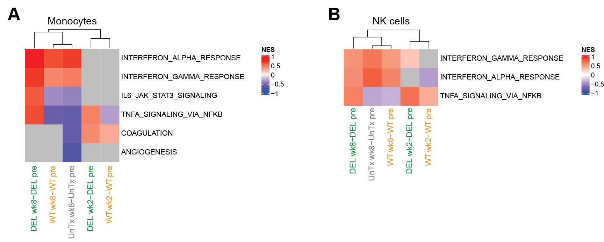

# Dias/Koup: Early bNAb Tx
R code to reproduce the transcriptomic analysis of the Dias/Koup project  

## List of figures:  
[Fig. 6AB](#fig-6ab)

### Fig. 6A-B  
  
Fig. 6A-B: [R code [MD]](code/)

## Supplemental material

### a. Set 1 RNA-Seq analysis:
code:  
- preprocessing: [[MD]](code/20200511_Joana.mrnaseq_preproc.md)

input:  
- non-normalized (raw) gene counts: [[CSV]](input/joana.genecounts.csv)  
- Rhesus genome annotation: [[GTF]](input/joana.genes.gtf)  
- alignment statistics: [[TSV]](input/joana.ReadStats.txt)  
- sample annotation: [[XLSX]](input/Joana\ Dias\ bulk\ RNAf\ Sample_tracking\ sheet_03082020.xlsx")  
- viral load and bnAb concentrations: [[XLSX]](input/Raw\ data\ for\ Slim_JD20200414.xlsx)
  
output:  
- raw SeqExpressionSet: [[RDA]](output/joana.esetRaw.RData)  
- normalized SeqExpressionSet: [[RDA]](output/joana.eset.RData)  
- baseline-substracted SeqExpressionSet: [[RDA]](output/joana.esetBaselined.RData)  
- DGEGLM list: [[RDA]](output/joana.fits.RData)  