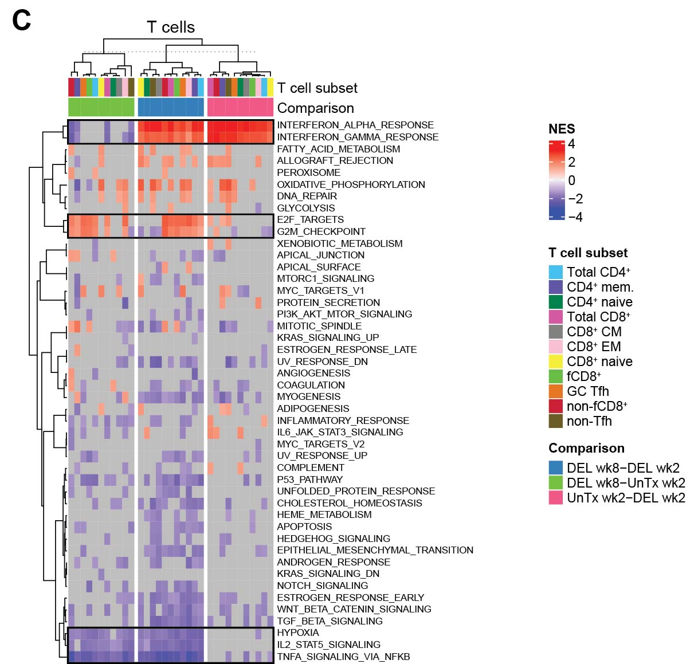

# Dias/Koup: Early bNAb Tx
R code to reproduce the transcriptomic analysis of the Dias/Koup project  

## List of figures:  
[Fig. 6A-B](#fig-6ab), [Fig. 6C](#fig-6c)  
  
### Fig. 6A-B  
  
Fig. 6A-B: [R code [MD]](code/20230203_Joana.fig6ab.md)  

### Fig. 6C

Fig. 6C: [R code [MD]](code/20220316_Joana2.fig6c.md)
  
## Supplemental material

### a. Set 1 RNA-Seq analysis:
code:  
- preprocessing: [[MD]](code/20200511_Joana.mrnaseq_preproc.md)
- genesets enrichment analysis: [[MD]](code/20200513_Joana.geneset_analysis.md)

input:  
- non-normalized (raw) gene counts: [[CSV]](input/joana.genecounts.csv)  
- Rhesus genome annotation (see data release)  
- alignment statistics: [[TSV]](input/joana.ReadStats.txt)  
- sample annotation: [[XLSX]](input/Joana_Dias_bulk_RNAf_Sample_tracking_sheet_03082020.xlsx)  
- viral load and bnAb concentrations: [[XLSX]](input/Raw_data_for_Slim_JD20200414.xlsx)
  
output:  
- raw SeqExpressionSet: [[RDA]](output/joana.esetRaw.RData)  
- normalized SeqExpressionSet: [[RDA]](output/joana.eset.RData)  
- baseline-substracted SeqExpressionSet: [[RDA]](output/joana.esetBaselined.RData)  
- DGEGLM list: [[RDA]](output/joana.fits.RData)
- GSEA output (see data release)

### b. Set 2 RNA-Seq analysis:  
code:  
- preprocessing: [[MD]](code/20210909_Joana2.mrnaseq_preproc.md)  
  
input:  
- non-normalized (raw) gene counts: [[CSV]](input/joana2.genecounts.csv)
- Rhesus genome annotation (see data release)
- alignment statistics: [[TSV]](input/joana2.ReadStats.txt)
- sample annotation: [[XLSX]](input/JoanaDias_Bulk_RNAseq_sampleTracking_06012021.xlsx), [[TSV]](input/RNAseq_II_for_Slim_20210829.slide3.txt)  

output:
- raw SeqExpressionSet: [[RDA]](output/joana2.esetRaw.RData)  
- normalized SeqExpressionSet: [[RDA]](output/joana2.eset.RData)  
- baseline-substracted SeqExpressionSet: [[RDA]](output/joana2.esetBaselined.RData)
- DGEGLM list (see data release)  
- fGSEA output (see data release)  