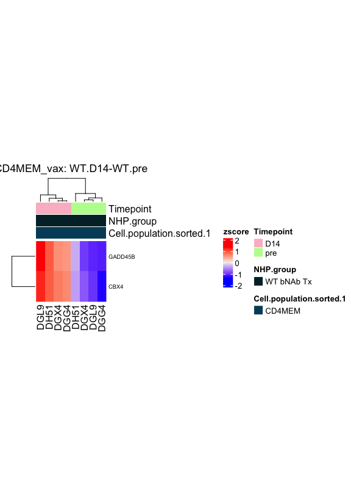

Dias/Koup preprocessing of RNA-Seq data (set 2)
================
Slim Fourati
2024-01-31

Load packages

``` r
suppressPackageStartupMessages(library(package = "knitr"))
suppressPackageStartupMessages(library(package = "kableExtra"))
suppressPackageStartupMessages(library(package = "readxl"))
suppressPackageStartupMessages(library(package = "EDASeq"))
suppressPackageStartupMessages(library(package = "pvca")) # dleelab/pvca
suppressPackageStartupMessages(library(package = "lme4"))
suppressPackageStartupMessages(library(package = "parallelDist"))
suppressPackageStartupMessages(library(package = "parallel"))
suppressPackageStartupMessages(library(package = "edgeR"))
suppressPackageStartupMessages(library(package = "ggbeeswarm"))
suppressPackageStartupMessages(library(package = "ComplexHeatmap"))
suppressPackageStartupMessages(library(package = "tidyverse"))
```

``` r
opts_chunk$set(echo = TRUE, fig.path = "../figure/")
options(readr.show_col_types   = FALSE,
        dplyr.summarise.inform = FALSE)
workDir <- dirname(getwd())
```

Reading raw counts

``` r
countDF <- read_csv(file = file.path(workDir, "input/joana2.genecounts.csv")) %>%
  as.data.frame() %>%
  column_to_rownames(var = "gene_id")
```

``` r
message("First five rows/columns of count matrix")
```

    ## First five rows/columns of count matrix

``` r
countDF[1:5, 1:5] %>%
  kable()
```

|                    | DGA7_D14_CD4 | DGA7_D14_CD4MEM | DGA7_D14_CD4NA | DGA7_D14_CD8 | DGA7_D14_CD8CM |
|:-------------------|-------------:|----------------:|---------------:|-------------:|---------------:|
| ENSMMUG00000000001 |           31 |             121 |             60 |           71 |             66 |
| ENSMMUG00000000002 |            2 |              10 |             11 |            6 |              5 |
| ENSMMUG00000000005 |          177 |             395 |            110 |          216 |            297 |
| ENSMMUG00000000006 |            0 |               1 |              0 |            0 |              0 |
| ENSMMUG00000000007 |            4 |              20 |             36 |           35 |             33 |

``` r
message("Dimensions of the count matrix")
```

    ## Dimensions of the count matrix

``` r
print(dim(countDF))
```

    ## [1] 35432   396

Read sample annotation

``` r
sampleAnnotFile <- file.path(workDir,
                             "input",
                             "JoanaDias_Bulk_RNAseq_sampleTracking_06012021.xlsx")
# read each plates
sampleAnnotDF <- read_excel(path = sampleAnnotFile,
                            .name_repair = function(x) make.unique(make.names(x)))
# append treatment info
treatFile <- file.path(workDir,
                       "input",
                       "RNAseq_II_for_Slim_20210829.slide3.txt")
treatDF <- read_tsv(file = treatFile, name_repair = make.names)
sampleAnnotDF <- merge(x = sampleAnnotDF, y = treatDF, by = "Monkey.ID")
# append sample id
sampleAnnotDF <- sampleAnnotDF %>%
  mutate(rowname = paste(Monkey.ID,
                         Timepoint,
                         Cell.population.sorted.1,
                         sep = "_"),
         rowname = gsub(pattern = " ", replacement = "", rowname)) %>%
   as.data.frame() %>%
  column_to_rownames(var = "rowname")
sampleAnnotDF <- sampleAnnotDF[colnames(countDF), ]
# TotalReads counted
sampleAnnotDF$TotalReads <- colSums(countDF)
```

``` r
message("print header of sample annotation")
```

    ## print header of sample annotation

``` r
sampleAnnotDF[1:5, 1:5] %>%
  kable()
```

|                 | Monkey.ID | Collaborator        | Sample. | Plate. | Sample.Type.Subset                    |
|:----------------|:----------|:--------------------|--------:|-------:|:--------------------------------------|
| DGA7_D14_CD4    | DGA7      | Joana Dias/Koup Lab |     117 |      2 | Total RNA from sorted cells in RNAzol |
| DGA7_D14_CD4MEM | DGA7      | Joana Dias/Koup Lab |     119 |      2 | Total RNA from sorted cells in RNAzol |
| DGA7_D14_CD4NA  | DGA7      | Joana Dias/Koup Lab |     118 |      2 | Total RNA from sorted cells in RNAzol |
| DGA7_D14_CD8    | DGA7      | Joana Dias/Koup Lab |     111 |      2 | Total RNA from sorted cells in RNAzol |
| DGA7_D14_CD8CM  | DGA7      | Joana Dias/Koup Lab |     116 |      2 | Total RNA from sorted cells in RNAzol |

``` r
message("Number of animal w/ RNA-seq data")
```

    ## Number of animal w/ RNA-seq data

``` r
sampleAnnotDF %>%
  .$Monkey.ID %>%
  unique() %>%
  length() %>%
  print()
```

    ## [1] 12

``` r
message("Number of timepoints and subsets w/ RNA-seq data")
```

    ## Number of timepoints and subsets w/ RNA-seq data

``` r
sampleAnnotDF %>%
  select(Monkey.ID, Timepoint, Cell.population.sorted.1) %>%
  distinct() %>%
  group_by(Timepoint, Cell.population.sorted.1) %>%
  summarize(n = n()) %>%
  ungroup() %>%
  mutate(Timepoint = factor(Timepoint, levels = c("pre", "D14", "wk8"))) %>%
  pivot_wider(names_from = Cell.population.sorted.1, values_from = n) %>%
  arrange(Timepoint) %>%
  kable()
```

| Timepoint | CD4 | CD4MEM | CD4NA | CD8 | CD8CM | CD8EM | CD8NA | GCTfh | fCD8 | nonTfh | nonfCD8 |
|:----------|----:|-------:|------:|----:|------:|------:|------:|------:|-----:|-------:|--------:|
| pre       |  12 |     12 |    12 |  12 |    12 |    12 |    12 |    12 |   12 |     12 |      12 |
| D14       |  12 |     12 |    12 |  12 |    12 |    12 |    12 |    12 |   12 |     12 |      12 |
| wk8       |  12 |     12 |    12 |  12 |    12 |    12 |    12 |    12 |   12 |     12 |      12 |

Transcriptomic profiles of 12 animals for 11 subsets at 3 timepoints was
performed.

Read gene annotation

``` r
colNames <- c("seqname",
              "source",
              "feature",
              "start",
              "end",
              "score",
              "strand",
              "frame",
              "attribute")
colTypes <- paste(c(rep("c", times = 3),
                    rep("i", times = 2),
                    rep("c", times = 4)),
                  collapse = "")
featuresAnnotationFile <- file.path(workDir, "input/joana2.genes.gtf")
skipNb <- read_lines(file = featuresAnnotationFile)
skipNb <- sum(grepl(pattern = "^#", skipNb))

featuresAnnot <- read_tsv(file      = featuresAnnotationFile,
                          skip      = skipNb,
                          col_names = colNames,
                          col_types = colTypes)
# extract gene_id and transcript_id from attributes
featAnnot <- featuresAnnot %>%
  mutate(gene_id = gsub(pattern = ".*gene_id \"([^;]+)\";.+",
                        replacement = "\\1",
                        attribute),
         gene_name = ifelse(test = grepl(pattern = "gene_name",
                                         attribute),
                            yes = gsub(pattern = ".+gene_name \"([^;]+)\";.+",
                                       replacement = "\\1",
                                       attribute),
                            no  = NA),
         gene_biotype = ifelse(test = grepl(pattern = "gene_biotype",
                                         attribute),
                            yes = gsub(pattern = ".+gene_biotype \"([^;]+)\";.*",
                                       replacement = "\\1",
                                       attribute),
                            no  = NA)) %>%
  select(seqname, strand, gene_id, gene_name, gene_biotype) %>%
  distinct() %>%
  as.data.frame()
rownames(featAnnot) <- featAnnot$gene_id
featAnnot <- featAnnot[rownames(countDF), ]
```

``` r
cat("Number of genes annotated")
```

    ## Number of genes annotated

``` r
featAnnot %>%
    group_by(gene_biotype) %>%
    summarize(n = n()) %>%
    arrange(desc(n)) %>%
  kable()
```

| gene_biotype         |     n |
|:---------------------|------:|
| protein_coding       | 21591 |
| lncRNA               |  4769 |
| misc_RNA             |  3419 |
| snRNA                |  1875 |
| snoRNA               |  1326 |
| pseudogene           |   679 |
| Y_RNA                |   666 |
| miRNA                |   626 |
| rRNA                 |   145 |
| IG_V_gene            |    88 |
| processed_pseudogene |    88 |
| TR_V_gene            |    48 |
| scaRNA               |    43 |
| Mt_tRNA              |    22 |
| TR_J_gene            |    21 |
| TR_C_gene            |     8 |
| vault_RNA            |     7 |
| ribozyme             |     4 |
| IG_C_gene            |     3 |
| IG_D_gene            |     2 |
| Mt_rRNA              |     2 |

Build raw SeqExpressionSet

``` r
# build  raw ExpressionSet
esetRaw <- newSeqExpressionSet(counts      = as.matrix(countDF),
                               featureData = AnnotatedDataFrame(featAnnot),
                               phenoData   = AnnotatedDataFrame(sampleAnnotDF))
save(esetRaw, file = file.path(workDir, "output/joana2.esetRaw.RData"))
print(esetRaw)
```

    ## SeqExpressionSet (storageMode: lockedEnvironment)
    ## assayData: 35432 features, 396 samples 
    ##   element names: counts, normalizedCounts, offset 
    ## protocolData: none
    ## phenoData
    ##   sampleNames: DGA7_D14_CD4 DGA7_D14_CD4MEM ... DHBC_wk8_nonTfh (396
    ##     total)
    ##   varLabels: Monkey.ID Collaborator ... TotalReads (31 total)
    ##   varMetadata: labelDescription
    ## featureData
    ##   featureNames: ENSMMUG00000000001 ENSMMUG00000000002 ...
    ##     ENSMMUG00000065388 (35432 total)
    ##   fvarLabels: seqname strand ... gene_biotype (5 total)
    ##   fvarMetadata: labelDescription
    ## experimentData: use 'experimentData(object)'
    ## Annotation:

Barplot with read alignment statistics

``` r
statDF <- read_tsv(file      = file.path(workDir, "input/joana2.ReadStats.txt"),
                   col_names = FALSE) %>%
  distinct() %>%
  spread(X3, X2)
plotDF <- counts(esetRaw) %>% 
  colSums() %>%
  data.frame(Counted = .) %>%
  rownames_to_column() %>%
  merge(x = statDF, by.x = "X1", by.y = "rowname")

plotDF <- plotDF %>%
  mutate(Trimmed    = TotalReads - Surviving,
         NotMapped  = Surviving - UniqMapped - Multimapped,
         NotCounted = UniqMapped + Multimapped - Counted) %>%
  select(Trimmed, NotMapped, NotCounted, Counted, X1) %>%
  arrange(Counted) %>% 
  mutate(X1 = factor(X1, levels = unique(X1))) %>%
  gather(key, value, -X1)
ggplot(data = plotDF,
       mapping = aes(x = X1, y = value, fill = key)) +
  geom_bar(stat = "identity") +
  scale_y_continuous(expand = c(0, 0)) +
  labs(x = "Samples", y = "Number of reads") +
  theme_bw() +
  theme(axis.text.x = element_blank(),
        axis.ticks.x = element_blank(),
        panel.grid.major = element_blank(),
        panel.grid.minor = element_blank())
```


``` r
message("number of samples with more than 2e06 counted reads")
plotDF %>%
  filter(key %in% "Counted") %>%
  mutate(over10e6 = value >= 2e06) %>%
  group_by(over10e6) %>%
  summarize(n())
```

    ## # A tibble: 2 × 2
    ##   over10e6 `n()`
    ##   <lgl>    <int>
    ## 1 FALSE        6
    ## 2 TRUE       390

``` r
message("6 samples below requirment for DEG analysis:")
pData(esetRaw)[as.vector(filter(plotDF, key %in% "Counted" & value < 2e06)$X1), ] %>%
  kable()
```

|                  | Monkey.ID | Collaborator        | Sample. | Plate. | Sample.Type.Subset                    | Study.. | Timepoint | Cell.population.sorted | Cell.population.sorted.1 | Sample.Well.or.tube.label | Number.of.Cells | Sample.Volume.ul. | Method.to.determine.RNA.conc. | RIN | Library.Preparation.Method                   | Library.Elution.volume | Index.well | Index.Primer.Name | Index.Primer.sequence | Final.library.conc…nM. | Final.avg.library.size..bp. | Date.Received | Pool..66.samples.pool. | Location.VRC | Illumina.Instrument | Flowcell.ID | Lane.sequenced | Date.Sequenced | Notes | NHP.group   | TotalReads |
|:-----------------|:----------|:--------------------|--------:|-------:|:--------------------------------------|--------:|:----------|:-----------------------|:-------------------------|:--------------------------|----------------:|------------------:|:------------------------------|:----|:---------------------------------------------|-----------------------:|:-----------|:------------------|:----------------------|-----------------------:|:----------------------------|:--------------|-----------------------:|:-------------|:--------------------|:------------|---------------:|:---------------|:------|:------------|-----------:|
| DGA7_D14_nonfCD8 | DGA7      | Joana Dias/Koup Lab |     114 |      2 | Total RNA from sorted cells in RNAzol |   730.6 | D14       | non-fCD8+              | nonfCD8                  | B3                        |            5000 |                10 | NA                            | NA  | NEBNext Ultra II RNA Library Preparation Kit |                     25 | B3         | P15               | TGGTACAG              |              0.2215850 | NA                          | NA            |                      2 | NA           | NovaSeq 6000        | HGH73DRXY   |              2 | 2021-06-29     | NA    | UnTx        |      55448 |
| DGH1_wk8_CD8NA   | DGH1      | Joana Dias/Koup Lab |      27 |      1 | Total RNA from sorted cells in RNAzol |   730.6 | wk8       | CD8+ naïve             | CD8NA                    | C4                        |            5000 |                10 | NA                            | NA  | NEBNext Ultra II RNA Library Preparation Kit |                     25 | C4         | P28               | GTAACGAC              |              0.6170620 | NA                          | NA            |                      1 | NA           | NovaSeq 6000        | HGH73DRXY   |              1 | 2021-06-29     | NA    | DEL bNAb Tx |     245885 |
| DHBC_D14_nonfCD8 | DHBC      | Joana Dias/Koup Lab |     378 |      4 | Total RNA from sorted cells in RNAzol |   730.6 | D14       | non-fCD8+              | nonfCD8                  | B12                       |            5000 |                10 | NA                            | NA  | NEBNext Ultra II RNA Library Preparation Kit |                     25 | B12        | P24               | ATTGCGTG              |              0.3831800 | NA                          | NA            |                      6 | NA           | NovaSeq 6000        | HGH5LDRXY   |              2 | 2021-06-30     | NA    | DEL bNAb Tx |     422567 |
| DGA7_pre_CD8     | DGA7      | Joana Dias/Koup Lab |     100 |      2 | Total RNA from sorted cells in RNAzol |   730.6 | pre       | total CD8+             | CD8                      | D1                        |            5000 |                10 | NA                            | NA  | NEBNext Ultra II RNA Library Preparation Kit |                     25 | D1         | P37               | AGACCGTA              |              1.3271829 | NA                          | NA            |                      2 | NA           | NovaSeq 6000        | HGH73DRXY   |              2 | 2021-06-29     | NA    | UnTx        |     456720 |
| DGG6_wk8_CD8NA   | DGG6      | Joana Dias/Koup Lab |      60 |      1 | Total RNA from sorted cells in RNAzol |   730.6 | wk8       | CD8+ naïve             | CD8NA                    | D8                        |            5000 |                10 | NA                            | NA  | NEBNext Ultra II RNA Library Preparation Kit |                     25 | D8         | P44               | ATCTCGCT              |              0.6257944 | NA                          | NA            |                      1 | NA           | NovaSeq 6000        | HGH73DRXY   |              1 | 2021-06-29     | NA    | UnTx        |     706247 |
| DGG6_pre_CD8     | DGG6      | Joana Dias/Koup Lab |      34 |      1 | Total RNA from sorted cells in RNAzol |   730.6 | pre       | total CD8+             | CD8                      | B5                        |            5000 |                10 | NA                            | NA  | NEBNext Ultra II RNA Library Preparation Kit |                     25 | B5         | P17               | GCTATCCT              |            101.9640219 | NA                          | NA            |                      1 | NA           | NovaSeq 6000        | HGH73DRXY   |              1 | 2021-06-29     | NA    | UnTx        |     967971 |

All samples except 6 have more than 2 million reads and can be used for
diff. expression analysis. <!--
DGA7_D14_nonfCD8: total number of reads low (ReadStats: 1,150,059)
DGA7_pre_CD8: alignment to non-annotated region (align.stat: _no_feature 8366919)
DGG6_pre_CD8: unaligned reads (starLog.final.out: % of reads unmapped: too short 85.48%)
DGG6_wk8_CD8NA: alignment to non-annotated region (align.stat: _no_feature 4704602)
DGH1_wk8_CD8NA: alignment to non-annotated region (align.stat: _no_feature 4851185)
DHBC_D14_nonfCD8: 
-->

Barplot with mapped reads statistics

``` r
plotDF <- counts(esetRaw) %>%
  as.data.frame() %>%
  rownames_to_column() %>%
  merge(y    = select(fData(esetRaw), gene_id, gene_biotype),
        by.x = "rowname",
        by.y = "gene_id") %>%
  mutate(gene_biotype = ifelse(test = grepl(pattern = "pseudogene",
                                            gene_biotype),
                               yes = "pseudogene",
                               no  = gene_biotype),
         gene_biotype = ifelse(test = gene_biotype %in% 
                                 c("miRNA", "lincRNA", "snoRNA",
                                   "sRNA", "snRNA", "vaultRNA",
                                   "3prime_overlapping_ncrna",
                                   "macro_lncRNA", "scaRNA"),
                               yes = "ncrna",
                               no = gene_biotype),
         gene_biotype = ifelse(test = gene_biotype %in% 
                                 c("antisense",
                                   "ncRNA",
                                   "Mt_rRNA",
                                   "Mt_tRNA",
                                   "protein_coding",
                                   "pseudogene",
                                   "ribozyme",
                                   "rRNA"),
                               yes = gene_biotype,
                               no  = "other")) %>%
  gather(sample, value, -rowname, -gene_biotype) %>%
  group_by(sample, gene_biotype) %>%
  summarize(eta = sum(value),
            mu  = mean(value),
            q2  = median(value)) %>%
  ungroup() %>%
  arrange(!grepl("Water", `sample`)) %>% 
  mutate(`sample` = factor(`sample`, levels = unique(`sample`)))

ggplot(data = plotDF,
       mapping = aes(x = sample, y = eta, fill = gene_biotype)) +
  geom_bar(stat = "identity") +
  scale_y_continuous(expand = c(0, 0)) +
  labs(x = "Samples", y = "Number of reads") +
  theme_bw() +
  theme(axis.text.x = element_blank(),
        axis.ticks.x = element_blank(),
        panel.grid.major = element_blank(),
        panel.grid.minor = element_blank())
```


``` r
message("percentage of reads that are from protein coding")
```

    ## percentage of reads that are from protein coding

``` r
plotDF %>% 
  group_by(sample) %>%
  summarize(n = sum(eta)) %>%
  merge(y = plotDF) %>%
  filter(gene_biotype %in% "protein_coding") %>%
  mutate(perc_prot_cod = eta/n * 100) %>%
  summarize(type = "perc_prot_coding",
            min  = min(.$perc_prot_cod, na.rm = TRUE),
            max  = max(.$perc_prot_cod, na.rm = TRUE)) 
```

    ##               type      min     max
    ## 1 perc_prot_coding 35.21459 98.4649

As expected, most counted reads are mapped to protein coding genes.

Principal variance component analysis (raw)

``` r
esetTemp <- ExpressionSet(assayData = log2(counts(esetRaw) + 0.25),
                          phenoData = AnnotatedDataFrame(data = pData(esetRaw)))

esetTemp$TotalReadsQ3 <- cut(esetTemp$TotalReads,
                             breaks         = quantile(esetTemp$TotalReads,
                                                       probs = c(0,0.33, 0.66,1)),
                             include.lowest = TRUE,
                             right          = TRUE)
esetTemp$NumberCellsQ3 <- cut(esetTemp$Number.of.Cells,
                              breaks         = c(0, 1500, 3000, 5000),
                              include.lowest = TRUE,
                              right          = TRUE)
esetTemp$lowCountedReads <- esetTemp$TotalReads < 2e6

fit <- PVCA(counts = exprs(esetTemp),
            meta = pData(esetTemp)[, c("Timepoint",
                                       "NHP.group",
                             "Monkey.ID",
                             "Cell.population.sorted.1",
                             "NumberCellsQ3",
                             "TotalReadsQ3",
                             "lowCountedReads")],
     threshold = 0.6,
     inter = FALSE)

plotDF <- data.frame(effect = as.vector(fit),
                     label  = names(fit)) %>%
  arrange(effect) %>%
  mutate(label = factor(label, levels = label))
ggplot(data = plotDF,
       mapping = aes(x = label, y = effect)) +
  geom_bar(stat = "identity") +
  labs(x = NULL, y = "Explained effect") +
  theme_bw() +
  theme(axis.text.x = element_text(angle = 90, vjust = 0.5, hjust = 1))
```


Subset, samples with low counts reads and animals are the main drivers
of the raw gene-expression.

Multidimensional scaling plot based on raw counts

``` r
rawMat <- counts(esetRaw)
mat <- rawMat[rowSums(rawMat) > 0, ]
mat <- log2(mat + 0.25)
distMat <- parallelDist(t(mat), threads = detectCores() - 1)
attributes(distMat)$Labels  <-  colnames(mat)
fit <- cmdscale(distMat, k = 2, eig = TRUE)
plotDF <- as.data.frame(fit$points)
plotDF <- plotDF %>%
    rownames_to_column() %>%
    merge(y = rownames_to_column(pData(esetRaw)),
          by = "rowname") %>%
  mutate(lowCountedReads = (TotalReads < 2e6))
ggplot(data    = plotDF,
                   mapping = aes(x     = V1,
                                 y     = V2,
                 color = Cell.population.sorted,
                 shape = lowCountedReads)) +
  geom_point(size = 4) +
  labs(x = paste0("1st dimension (",
                        round((fit$eig/sum(fit$eig))[1] * 100),
                        "%)"),
                    y = paste0("2nd dimension (",
                        round((fit$eig/sum(fit$eig))[2] * 100),
                        "%)")) +
  theme_bw()
```


``` r
filter(plotDF,V1 > 300)
```

    ##            rowname       V1        V2 Monkey.ID        Collaborator Sample.
    ## 1 DGA7_D14_nonfCD8 866.8445 -11.33078      DGA7 Joana Dias/Koup Lab     114
    ## 2     DGA7_pre_CD8 513.3055 310.34905      DGA7 Joana Dias/Koup Lab     100
    ## 3     DGG6_pre_CD8 351.2199 -38.84293      DGG6 Joana Dias/Koup Lab      34
    ## 4   DGG6_wk8_CD8NA 703.3137 150.16881      DGG6 Joana Dias/Koup Lab      60
    ## 5   DGH1_wk8_CD8NA 701.7878 149.36020      DGH1 Joana Dias/Koup Lab      27
    ## 6 DHBC_D14_nonfCD8 555.1679 -55.52795      DHBC Joana Dias/Koup Lab     378
    ##   Plate.                    Sample.Type.Subset Study.. Timepoint
    ## 1      2 Total RNA from sorted cells in RNAzol   730.6       D14
    ## 2      2 Total RNA from sorted cells in RNAzol   730.6       pre
    ## 3      1 Total RNA from sorted cells in RNAzol   730.6       pre
    ## 4      1 Total RNA from sorted cells in RNAzol   730.6       wk8
    ## 5      1 Total RNA from sorted cells in RNAzol   730.6       wk8
    ## 6      4 Total RNA from sorted cells in RNAzol   730.6       D14
    ##   Cell.population.sorted Cell.population.sorted.1 Sample.Well.or.tube.label
    ## 1              non-fCD8+                  nonfCD8                        B3
    ## 2             total CD8+                      CD8                        D1
    ## 3             total CD8+                      CD8                        B5
    ## 4             CD8+ naïve                    CD8NA                        D8
    ## 5             CD8+ naïve                    CD8NA                        C4
    ## 6              non-fCD8+                  nonfCD8                       B12
    ##   Number.of.Cells Sample.Volume.ul. Method.to.determine.RNA.conc. RIN
    ## 1            5000                10                            NA  NA
    ## 2            5000                10                            NA  NA
    ## 3            5000                10                            NA  NA
    ## 4            5000                10                            NA  NA
    ## 5            5000                10                            NA  NA
    ## 6            5000                10                            NA  NA
    ##                     Library.Preparation.Method Library.Elution.volume
    ## 1 NEBNext Ultra II RNA Library Preparation Kit                     25
    ## 2 NEBNext Ultra II RNA Library Preparation Kit                     25
    ## 3 NEBNext Ultra II RNA Library Preparation Kit                     25
    ## 4 NEBNext Ultra II RNA Library Preparation Kit                     25
    ## 5 NEBNext Ultra II RNA Library Preparation Kit                     25
    ## 6 NEBNext Ultra II RNA Library Preparation Kit                     25
    ##   Index.well Index.Primer.Name Index.Primer.sequence Final.library.conc...nM.
    ## 1         B3               P15              TGGTACAG                0.2215850
    ## 2         D1               P37              AGACCGTA                1.3271829
    ## 3         B5               P17              GCTATCCT              101.9640219
    ## 4         D8               P44              ATCTCGCT                0.6257944
    ## 5         C4               P28              GTAACGAC                0.6170620
    ## 6        B12               P24              ATTGCGTG                0.3831800
    ##   Final.avg.library.size..bp. Date.Received Pool..66.samples.pool. Location.VRC
    ## 1                          NA            NA                      2           NA
    ## 2                          NA            NA                      2           NA
    ## 3                          NA            NA                      1           NA
    ## 4                          NA            NA                      1           NA
    ## 5                          NA            NA                      1           NA
    ## 6                          NA            NA                      6           NA
    ##   Illumina.Instrument Flowcell.ID Lane.sequenced Date.Sequenced Notes
    ## 1        NovaSeq 6000   HGH73DRXY              2     2021-06-29    NA
    ## 2        NovaSeq 6000   HGH73DRXY              2     2021-06-29    NA
    ## 3        NovaSeq 6000   HGH73DRXY              1     2021-06-29    NA
    ## 4        NovaSeq 6000   HGH73DRXY              1     2021-06-29    NA
    ## 5        NovaSeq 6000   HGH73DRXY              1     2021-06-29    NA
    ## 6        NovaSeq 6000   HGH5LDRXY              2     2021-06-30    NA
    ##     NHP.group TotalReads lowCountedReads
    ## 1        UnTx      55448            TRUE
    ## 2        UnTx     456720            TRUE
    ## 3        UnTx     967971            TRUE
    ## 4        UnTx     706247            TRUE
    ## 5 DEL bNAb Tx     245885            TRUE
    ## 6 DEL bNAb Tx     422567            TRUE

Samples with low read counts are indeed the main driver of raw
gene-expression.

Normalize (TMM) count data

``` r
# remove low counts samples
esetTemp <- esetRaw[, esetRaw$TotalReads >= 9e5]
dge <- DGEList(counts       = counts(esetTemp),
               remove.zeros = TRUE)
# remove low expressed genes
flag <- filterByExpr(dge, group = esetRaw$Cell.population.sorted)
dge <- dge[flag, , keep.lib.sizes = FALSE]
dge <- calcNormFactors(object = dge, method = "TMM")
normalizedCounts <- cpm(dge, normalized.lib.sizes = TRUE, log = TRUE)
eset <-  newSeqExpressionSet(
    counts           = dge$counts,
    normalizedCounts = as.matrix(normalizedCounts),
    featureData      = fData(esetTemp)[rownames(normalizedCounts), ],
    phenoData        = pData(esetTemp))
save(eset, file = file.path(workDir, "output/joana2.eset.RData"))
print(eset)
```

    ## SeqExpressionSet (storageMode: lockedEnvironment)
    ## assayData: 14986 features, 391 samples 
    ##   element names: counts, normalizedCounts, offset 
    ## protocolData: none
    ## phenoData
    ##   sampleNames: DGA7_D14_CD4 DGA7_D14_CD4MEM ... DHBC_wk8_nonTfh (391
    ##     total)
    ##   varLabels: Monkey.ID Collaborator ... TotalReads (31 total)
    ##   varMetadata: labelDescription
    ## featureData
    ##   featureNames: ENSMMUG00000000001 ENSMMUG00000000002 ...
    ##     ENSMMUG00000065387 (14986 total)
    ##   fvarLabels: seqname strand ... gene_biotype (5 total)
    ##   fvarMetadata: labelDescription
    ## experimentData: use 'experimentData(object)'
    ## Annotation:

Principal variance component analysis (normalized)

``` r
esetTemp <- ExpressionSet(assayData = normCounts(eset),
                          phenoData = AnnotatedDataFrame(data = pData(eset)))
esetTemp$TotalReadsQ3 <- cut(esetTemp$TotalReads,
                             breaks         = quantile(esetTemp$TotalReads,
                                                       probs = c(0,0.33, 0.66,1)),
                         include.lowest = TRUE,
                         right          = TRUE)
fit <- PVCA(counts = exprs(esetTemp),
            meta = pData(esetTemp)[, c("Timepoint",
                                       "NHP.group",
                             "Monkey.ID",
                             "Cell.population.sorted.1",
                             "TotalReadsQ3")],
                           threshold = 0.6,
                           inter = FALSE)
plotDF <- data.frame(effect = as.vector(fit),
                     label  = names(fit)) %>%
  arrange(effect) %>%
  mutate(label = factor(label, levels = unique(label)))
ggplot(data = plotDF,
       mapping = aes(x = label, y = effect)) +
  geom_bar(stat = "identity") +
  labs(x = NULL, y = "Explained effect") +
  theme_bw() +
  theme(axis.text.x = element_text(angle = 90, vjust = 0.5, hjust = 1))
```


After normalization (for total number of reads counted per samples),
subset remain the main drivers of expression.

Multidimensional scalling plot on normalized counts

``` r
# mds normalized/cpm counts
mat <- normCounts(eset)
distMat <- parallelDist(t(mat), threads = detectCores() - 1)
attributes(distMat)$Labels  <- colnames(mat)
fit <- cmdscale(distMat, k = 2, eig = TRUE)
plotDF <- as.data.frame(fit$points) %>%
  rownames_to_column() %>%
  merge(y = rownames_to_column(pData(eset)),
        by = "rowname")
plotLabel <- round((fit$eig/sum(fit$eig)) * 100)
plotLabel <- plotLabel[1:2]
plotLabel <- paste0(c("1st dimension (", "2nd dimension ("),
                    plotLabel,
                    "%)")
ggplot(data = plotDF,
       mapping = aes(x = V1,
                     y = V2,
                     color = Cell.population.sorted.1,
                     shape = NHP.group)) +
  geom_point(size = 4) +
  labs(x = plotLabel[[1]],
       y = plotLabel[[2]]) +
  theme_bw() +
  theme(legend.key = element_blank(),
        plot.title = element_text(hjust = 0.5))
```


After normalization (for total number of reads counted per samples),
subset remain the main driver of expression

Jitter plot of genes coding for cell surface markers

``` r
geneLS <- c("CD4", "CD8A")
plotDF <- counts(eset[fData(eset)$gene_name %in% geneLS, ]) %>%
  as.data.frame() %>%
  rownames_to_column() %>%
  merge(y = select(fData(eset), gene_id, gene_name),
    by.x = "rowname",
    by.y = "gene_id") %>%
  select(-rowname) %>%
  gather(SampleID, count, -gene_name) %>%
  merge(y = select(rownames_to_column(pData(eset)),
           rowname,
           Cell.population.sorted.1),
    by.x = "SampleID",
    by.y = "rowname") %>%
  mutate(value = pmax(count, 0.1))
ggplot(plotDF,
          mapping = aes(x = Cell.population.sorted.1, y = value)) +
  geom_boxplot(outlier.color = "transparent") +
  geom_beeswarm(mapping = aes(color = Cell.population.sorted.1)) +
  scale_y_log10() +
  facet_wrap(facet = ~gene_name, scale = "free", nrow = 3) +
  theme_bw() +
  theme(axis.text  = element_text(size = 5),
    legend.pos = "none")
```


``` r
geneLS <- c("CD28", "CXCR5", "PDCD1")
plotDF <- counts(eset[fData(eset)$gene_name %in% geneLS, eset$Cell.population.sorted.1 %in%
                        c("CD4", "CD4MEM", "CD4NA", "GCTfh", "nonTfh")]) %>%
  as.data.frame() %>%
  rownames_to_column() %>%
  merge(y = select(fData(eset), gene_id, gene_name),
    by.x = "rowname",
    by.y = "gene_id") %>%
  select(-rowname) %>%
  gather(SampleID, count, -gene_name) %>%
  merge(y = select(rownames_to_column(pData(eset)),
           rowname,
           Cell.population.sorted.1),
    by.x = "SampleID",
    by.y = "rowname") %>%
  mutate(value = pmax(count, 0.1))
ggplot(plotDF,
          mapping = aes(x = Cell.population.sorted.1, y = value)) +
  geom_boxplot(outlier.color = "transparent") +
  geom_beeswarm(mapping = aes(color = Cell.population.sorted.1)) +
  scale_y_log10() +
  facet_wrap(facet = ~gene_name, scale = "free", nrow = 3) +
  theme_bw() +
  theme(axis.text  = element_text(size = 5),
    legend.pos = "none")
```


<!-- FAS/CD95 is not annotated in Mmul_10, RefSeq has a FAS annotation,
     mapped to transcript STAMBPL1-206-208 (chr9:89235316-89305989)
     while STAMBPL1 is really transcript STAMBPL1-201-205 (chr9:89096395-89234286)
-->

``` r
geneLS <- c("CCR7", "CD28", "CXCR5", "PDCD1")
plotDF <- counts(eset[fData(eset)$gene_name %in% geneLS, eset$Cell.population.sorted.1 %in%
                        c("CD8", "CD8CM", "CD8EM", "CD8NA", "fCD8", "nonfCD8")]) %>%
  as.data.frame() %>%
  rownames_to_column() %>%
  merge(y = select(fData(eset), gene_id, gene_name),
    by.x = "rowname",
    by.y = "gene_id") %>%
  select(-rowname) %>%
  gather(SampleID, count, -gene_name) %>%
  merge(y = select(rownames_to_column(pData(eset)),
           rowname,
           Cell.population.sorted.1),
    by.x = "SampleID",
    by.y = "rowname") %>%
  mutate(value = pmax(count, 0.1))
ggplot(plotDF,
          mapping = aes(x = Cell.population.sorted.1, y = value)) +
  geom_boxplot(outlier.color = "transparent") +
  geom_beeswarm(mapping = aes(color = Cell.population.sorted.1)) +
  scale_y_log10() +
  facet_wrap(facet = ~gene_name, scale = "free", nrow = 3) +
  theme_bw() +
  theme(axis.text  = element_text(size = 5),
    legend.pos = "none")
```


Principal variance component analysis per subset

``` r
plotDF <- NULL
for (SUBSET in unique(eset$Cell.population.sorted.1)) {
  esetTemp <- eset[, eset$Cell.population.sorted.1 %in% SUBSET]
  esetTemp <- ExpressionSet(assayData = normCounts(esetTemp),
                phenoData = AnnotatedDataFrame(data = pData(esetTemp)))
  fit <- PVCA(counts = exprs(esetTemp),
          meta = pData(esetTemp)[, c("Timepoint",
                     "NHP.group",
                     "Monkey.ID")],
                           threshold = 0.6,
                           inter = FALSE)
  plotTemp <- data.frame(effect = as.vector(fit),
             label  = names(fit)) %>%
    arrange(effect) %>%
    mutate(label = factor(label, levels = unique(label)),
       Cell.population.sorted.1 = SUBSET)
  plotDF <- rbind(plotDF, plotTemp)
}

ggplot(data = plotDF,
       mapping = aes(x = label, y = effect)) +
  geom_bar(stat = "identity") +
  labs(x = NULL, y = "Explained effect") +
  theme_bw() +
  facet_wrap(facets = ~Cell.population.sorted.1) +
  theme(axis.text.x = element_text(angle = 90, vjust = 0.5, hjust = 1))
```


Donor effect is observed in all subsets

Substrack pre expression

``` r
# merge replicate samples
flagDF <- pData(eset) %>%
  rownames_to_column() %>%
  select(Monkey.ID, Timepoint, Cell.population.sorted.1, rowname) %>%
  pivot_wider(names_from = Timepoint, values_from = rowname) %>%
  pivot_longer(cols = c("D14", "wk8"),
               names_to = "Timepoint",
               values_to = "rowname") %>%
  filter(!is.na(pre) & !is.na(rowname))
esetBaselined <- eset[, flagDF$rowname]
baselinedMat <- normCounts(eset)[, flagDF$rowname] -
  normCounts(eset)[, flagDF$pre]
normCounts(esetBaselined) <- baselinedMat
save(esetBaselined, file = file.path(workDir, "output/joana2.esetBaselined.RData"))
print(esetBaselined)
```

    ## SeqExpressionSet (storageMode: lockedEnvironment)
    ## assayData: 14986 features, 258 samples 
    ##   element names: counts, normalizedCounts, offset 
    ## protocolData: none
    ## phenoData
    ##   sampleNames: DGA7_D14_CD4 DGA7_wk8_CD4 ... DHBC_wk8_nonfCD8 (258
    ##     total)
    ##   varLabels: Monkey.ID Collaborator ... TotalReads (31 total)
    ##   varMetadata: labelDescription
    ## featureData
    ##   featureNames: ENSMMUG00000000001 ENSMMUG00000000002 ...
    ##     ENSMMUG00000065387 (14986 total)
    ##   fvarLabels: seqname strand ... gene_biotype (5 total)
    ##   fvarMetadata: labelDescription
    ## experimentData: use 'experimentData(object)'
    ## Annotation:

Principal variance component analysis per subset (on baselined
expression)

``` r
plotDF <- NULL
for (SUBSET in unique(esetBaselined$Cell.population.sorted.1)) {
  esetTemp <- esetBaselined[, esetBaselined$Cell.population.sorted.1 %in% SUBSET]
  esetTemp <- ExpressionSet(assayData = normCounts(esetTemp),
                            phenoData = AnnotatedDataFrame(data = pData(esetTemp)))
  fit <- PVCA(counts = exprs(esetTemp),
              meta = pData(esetTemp)[, c("Timepoint",
                                         "NHP.group",
                                         "Monkey.ID")],
                           threshold = 0.6,
                           inter = FALSE)
  plotTemp <- data.frame(effect = as.vector(fit),
                         label  = names(fit)) %>%
    arrange(effect) %>%
    mutate(label = factor(label, levels = unique(label)),
           Cell.population.sorted.1 = SUBSET)
  plotDF <- rbind(plotDF, plotTemp)
}

ggplot(data = plotDF,
       mapping = aes(x = label, y = effect)) +
  geom_bar(stat = "identity") +
  labs(x = NULL, y = "Explained effect") +
  theme_bw() +
  facet_wrap(facets = ~Cell.population.sorted.1) +
  theme(axis.text.x = element_text(angle = 90, vjust = 0.5, hjust = 1))
```


Treatment effect is better observed on pre-post expression.

Multidimensional scalling plot on baselined counts by subsets

``` r
plotDF <- NULL
for (SUBSET in unique(esetBaselined$Cell.population.sorted.1)) {
  # mds normalized/cpm counts
  esetTemp <- esetBaselined[, esetBaselined$Cell.population.sorted.1 %in% SUBSET]

  mat <- normCounts(esetTemp)
  distMat <- parallelDist(t(mat), threads = detectCores() - 1)
  attributes(distMat)$Labels  <- colnames(mat)
  fit <- cmdscale(distMat, k = 2, eig = TRUE)
  as.data.frame(fit$points) %>%
    rownames_to_column() %>%
    merge(y = rownames_to_column(pData(eset)),
          by = "rowname") %>%
    rbind(plotDF, .) -> plotDF
}

ggplot(data = plotDF,
                   mapping = aes(x = V1,
                                 y = V2,
                                 color = Timepoint,
                                 shape = NHP.group)) +
  geom_point(size = 4) +
  facet_wrap(facets = ~Cell.population.sorted.1, scale = "free") +
  theme_bw() +
  theme(legend.key = element_blank(),
        plot.title = element_text(hjust = 0.5))
```


Differential expression between timepoints (paired)

``` r
fits <- list()
# vaccine effect
for (SUBSET in unique(eset$Cell.population.sorted.1)) {
  esetTemp <- eset[, eset$Cell.population.sorted.1 %in% SUBSET]
  dge <- DGEList(counts  = counts(esetTemp),
                 samples = pData(esetTemp),
                 genes   = fData(esetTemp))
  goi <- interaction(gsub(pattern     = " .+",
                          replacement = "",
                          esetTemp$NHP.group),
                     esetTemp$Timepoint,
                     drop = TRUE)
  donor <- esetTemp$Monkey.ID
  designMat <- model.matrix(~0+goi) 
  rownames(designMat) <- sampleNames(esetTemp)
  colnames(designMat) <- gsub(pattern     = "goi",
                              replacement = "",
                              colnames(designMat))
  attr(designMat, "assign") <- attr(designMat, "contrasts") <- NULL
  v <- voom(counts = dge, design = designMat)
  corfit <- duplicateCorrelation(v$E,
                                 design = designMat,
                                 block  = donor)
  fit <- lmFit(v,
               design      = designMat,
               block       = donor,
               correlation = corfit$consensus)
  contrastLS <- grep(pattern = "pre", colnames(fit), value = TRUE, invert = TRUE) %>%
    paste0(., "-", gsub(pattern = "\\..+", replacement = ".pre", .))
  contrastMat <- makeContrasts(contrasts = contrastLS, levels = fit$design)
  fit2 <- contrasts.fit(fit = fit, contrasts = contrastMat)
  fit2 <- eBayes(fit = fit2)
  fits[[paste0(SUBSET, "_vax")]] <- list(fit = fit, fit2 = fit2)
}

# vaccine vs untreated
for (SUBSET in unique(esetBaselined$Cell.population.sorted.1)) {
  esetTemp <- esetBaselined[, esetBaselined$Cell.population.sorted.1 %in% SUBSET]
  goi <- interaction(gsub(pattern     = " .+",
                          replacement = "",
                          esetTemp$NHP.group),
                     esetTemp$Timepoint,
                     drop = TRUE)
  designMat <- model.matrix(~0+goi) 
  rownames(designMat) <- sampleNames(esetTemp)
  colnames(designMat) <- gsub(pattern     = "goi",
                              replacement = "",
                              colnames(designMat))
  attr(designMat, "assign") <- attr(designMat, "contrasts") <- NULL
  dge <- ExpressionSet(assayData =normCounts(esetTemp),
                 phenoData = AnnotatedDataFrame(pData(esetTemp)),
                 featureData   = AnnotatedDataFrame(fData(esetTemp)))
  fit <- lmFit(dge,
               design      = designMat)
  contrastLS <- grep(pattern = "UnTx", colnames(fit), value = TRUE, invert = TRUE) %>%
    paste0(., "-", gsub(pattern = ".+\\.", replacement = "UnTx.", .))
  contrastMat <- makeContrasts(contrasts = contrastLS, levels = fit$design)
  fit2 <- contrasts.fit(fit = fit, contrasts = contrastMat)
  fit2 <- eBayes(fit = fit2)
  fits[[paste0(SUBSET, "_untx")]] <- list(fit = fit, fit2 = fit2)
}
# save fits
save(fits, file = file.path(workDir, "output/joana2.fits.RData"))
```

``` r
# print number of genes differently expressed
degNbDF <- NULL 
for (modelName in names(fits)) {
  fit2 <- fits[[modelName]][["fit2"]]
  for (coefName in colnames(fit2)) {
    top <- topTable(fit = fit2, coef = coefName, number = Inf) %>%
      as.data.frame() %>%
      filter(gene_biotype %in% "protein_coding") %>%
      group_by(sign(logFC)) %>%
      summarize(p     = sum(P.Value <= 0.05),
                adj.p = sum(adj.P.Val <= 0.05)) %>%
      mutate(modelName = modelName,
             contrast = coefName) %>%
      rbind(degNbDF) -> degNbDF
  }
}

degNbDF %>%
  pivot_longer(cols = c(-modelName, -contrast, -`sign(logFC)`),
               names_to = "cname",
               values_to = "n") %>%
  mutate(`sign(logFC)` = c("-1" = "DN", "1" = "UP")[as.character(`sign(logFC)`)],
         cname         = paste0(cname, `sign(logFC)`)) %>%
  select(-`sign(logFC)`) %>%
  pivot_wider(names_from = cname, values_from = n) %>%
  mutate(p = paste0(pUP, "/", pDN),
         adj.p = paste0(adj.pUP, "/", adj.pDN)) %>%
  select(modelName, contrast, p, adj.p) %>%
  as.data.frame() %>%
  kable()
```

| modelName    | contrast          | p         | adj.p   |
|:-------------|:------------------|:----------|:--------|
| CD8_untx     | WT.wk8-UnTx.wk8   | 542/710   | 0/0     |
| CD8_untx     | DEL.wk8-UnTx.wk8  | 616/698   | 0/0     |
| CD8_untx     | WT.D14-UnTx.D14   | 342/577   | 0/0     |
| CD8_untx     | DEL.D14-UnTx.D14  | 258/499   | 0/0     |
| nonfCD8_untx | WT.wk8-UnTx.wk8   | 280/243   | 0/0     |
| nonfCD8_untx | DEL.wk8-UnTx.wk8  | 521/373   | 0/0     |
| nonfCD8_untx | WT.D14-UnTx.D14   | 381/409   | 0/0     |
| nonfCD8_untx | DEL.D14-UnTx.D14  | 225/335   | 0/0     |
| nonTfh_untx  | WT.wk8-UnTx.wk8   | 325/357   | 0/0     |
| nonTfh_untx  | DEL.wk8-UnTx.wk8  | 379/346   | 0/0     |
| nonTfh_untx  | WT.D14-UnTx.D14   | 309/415   | 0/0     |
| nonTfh_untx  | DEL.D14-UnTx.D14  | 598/554   | 0/0     |
| GCTfh_untx   | WT.wk8-UnTx.wk8   | 669/726   | 0/0     |
| GCTfh_untx   | DEL.wk8-UnTx.wk8  | 381/365   | 0/0     |
| GCTfh_untx   | WT.D14-UnTx.D14   | 358/280   | 0/0     |
| GCTfh_untx   | DEL.D14-UnTx.D14  | 478/312   | 0/0     |
| fCD8_untx    | WT.wk8-UnTx.wk8   | 403/526   | 0/1     |
| fCD8_untx    | DEL.wk8-UnTx.wk8  | 672/857   | 0/0     |
| fCD8_untx    | WT.D14-UnTx.D14   | 336/363   | 0/0     |
| fCD8_untx    | DEL.D14-UnTx.D14  | 241/330   | 0/0     |
| CD8NA_untx   | WT.wk8-UnTx.wk8   | 168/275   | 0/0     |
| CD8NA_untx   | DEL.wk8-UnTx.wk8  | 281/337   | 0/0     |
| CD8NA_untx   | WT.D14-UnTx.D14   | 236/381   | 0/0     |
| CD8NA_untx   | DEL.D14-UnTx.D14  | 282/381   | 0/0     |
| CD8EM_untx   | WT.wk8-UnTx.wk8   | 325/286   | 0/0     |
| CD8EM_untx   | DEL.wk8-UnTx.wk8  | 727/1079  | 2/1     |
| CD8EM_untx   | WT.D14-UnTx.D14   | 640/454   | 0/0     |
| CD8EM_untx   | DEL.D14-UnTx.D14  | 493/389   | 0/0     |
| CD8CM_untx   | WT.wk8-UnTx.wk8   | 465/421   | 0/0     |
| CD8CM_untx   | DEL.wk8-UnTx.wk8  | 463/494   | 0/0     |
| CD8CM_untx   | WT.D14-UnTx.D14   | 429/257   | 0/0     |
| CD8CM_untx   | DEL.D14-UnTx.D14  | 333/286   | 0/0     |
| CD4NA_untx   | WT.wk8-UnTx.wk8   | 305/439   | 0/0     |
| CD4NA_untx   | DEL.wk8-UnTx.wk8  | 308/367   | 0/0     |
| CD4NA_untx   | WT.D14-UnTx.D14   | 345/318   | 0/0     |
| CD4NA_untx   | DEL.D14-UnTx.D14  | 345/341   | 0/0     |
| CD4MEM_untx  | WT.wk8-UnTx.wk8   | 282/281   | 0/0     |
| CD4MEM_untx  | DEL.wk8-UnTx.wk8  | 363/414   | 0/0     |
| CD4MEM_untx  | WT.D14-UnTx.D14   | 497/406   | 0/1     |
| CD4MEM_untx  | DEL.D14-UnTx.D14  | 895/592   | 0/0     |
| CD4_untx     | WT.wk8-UnTx.wk8   | 436/426   | 0/0     |
| CD4_untx     | DEL.wk8-UnTx.wk8  | 307/405   | 0/0     |
| CD4_untx     | WT.D14-UnTx.D14   | 236/365   | 0/0     |
| CD4_untx     | DEL.D14-UnTx.D14  | 222/283   | 0/0     |
| nonfCD8_vax  | WT.wk8-WT.pre     | 1180/444  | 6/9     |
| nonfCD8_vax  | UnTx.wk8-UnTx.pre | 1726/751  | 230/99  |
| nonfCD8_vax  | DEL.wk8-DEL.pre   | 1940/764  | 155/60  |
| nonfCD8_vax  | WT.D14-WT.pre     | 290/345   | 0/0     |
| nonfCD8_vax  | UnTx.D14-UnTx.pre | 349/394   | 3/0     |
| nonfCD8_vax  | DEL.D14-DEL.pre   | 235/628   | 0/0     |
| nonTfh_vax   | WT.wk8-WT.pre     | 1094/484  | 9/35    |
| nonTfh_vax   | UnTx.wk8-UnTx.pre | 1708/903  | 334/197 |
| nonTfh_vax   | DEL.wk8-DEL.pre   | 795/542   | 0/4     |
| nonTfh_vax   | WT.D14-WT.pre     | 257/403   | 0/0     |
| nonTfh_vax   | UnTx.D14-UnTx.pre | 567/554   | 0/0     |
| nonTfh_vax   | DEL.D14-DEL.pre   | 268/362   | 0/0     |
| GCTfh_vax    | WT.wk8-WT.pre     | 1053/608  | 21/54   |
| GCTfh_vax    | UnTx.wk8-UnTx.pre | 2361/1328 | 984/520 |
| GCTfh_vax    | DEL.wk8-DEL.pre   | 1649/881  | 187/101 |
| GCTfh_vax    | WT.D14-WT.pre     | 317/181   | 2/0     |
| GCTfh_vax    | UnTx.D14-UnTx.pre | 491/408   | 0/0     |
| GCTfh_vax    | DEL.D14-DEL.pre   | 242/180   | 0/0     |
| fCD8_vax     | WT.wk8-WT.pre     | 1333/1084 | 135/176 |
| fCD8_vax     | UnTx.wk8-UnTx.pre | 1936/1394 | 739/567 |
| fCD8_vax     | DEL.wk8-DEL.pre   | 1331/583  | 35/22   |
| fCD8_vax     | WT.D14-WT.pre     | 324/774   | 10/0    |
| fCD8_vax     | UnTx.D14-UnTx.pre | 539/999   | 1/3     |
| fCD8_vax     | DEL.D14-DEL.pre   | 250/744   | 0/0     |
| CD8NA_vax    | WT.wk8-WT.pre     | 655/487   | 12/17   |
| CD8NA_vax    | UnTx.wk8-UnTx.pre | 1295/618  | 173/88  |
| CD8NA_vax    | DEL.wk8-DEL.pre   | 1053/432  | 18/2    |
| CD8NA_vax    | WT.D14-WT.pre     | 226/323   | 2/0     |
| CD8NA_vax    | UnTx.D14-UnTx.pre | 473/414   | 0/0     |
| CD8NA_vax    | DEL.D14-DEL.pre   | 977/386   | 1/0     |
| CD8EM_vax    | WT.wk8-WT.pre     | 836/518   | 7/19    |
| CD8EM_vax    | UnTx.wk8-UnTx.pre | 1469/877  | 178/123 |
| CD8EM_vax    | DEL.wk8-DEL.pre   | 1720/1041 | 140/86  |
| CD8EM_vax    | WT.D14-WT.pre     | 216/310   | 0/0     |
| CD8EM_vax    | UnTx.D14-UnTx.pre | 626/935   | 0/0     |
| CD8EM_vax    | DEL.D14-DEL.pre   | 138/396   | 0/0     |
| CD8CM_vax    | WT.wk8-WT.pre     | 821/440   | 3/16    |
| CD8CM_vax    | UnTx.wk8-UnTx.pre | 2309/646  | 421/111 |
| CD8CM_vax    | DEL.wk8-DEL.pre   | 545/270   | 0/2     |
| CD8CM_vax    | WT.D14-WT.pre     | 244/251   | 0/0     |
| CD8CM_vax    | UnTx.D14-UnTx.pre | 482/585   | 0/0     |
| CD8CM_vax    | DEL.D14-DEL.pre   | 181/259   | 0/0     |
| CD8_vax      | WT.wk8-WT.pre     | 945/558   | 21/45   |
| CD8_vax      | UnTx.wk8-UnTx.pre | 1499/781  | 121/63  |
| CD8_vax      | DEL.wk8-DEL.pre   | 1041/373  | 13/9    |
| CD8_vax      | WT.D14-WT.pre     | 395/423   | 9/0     |
| CD8_vax      | UnTx.D14-UnTx.pre | 590/415   | 0/0     |
| CD8_vax      | DEL.D14-DEL.pre   | 821/908   | 46/8    |
| CD4NA_vax    | WT.wk8-WT.pre     | 865/951   | 25/69   |
| CD4NA_vax    | UnTx.wk8-UnTx.pre | 1256/910  | 181/164 |
| CD4NA_vax    | DEL.wk8-DEL.pre   | 742/446   | 19/19   |
| CD4NA_vax    | WT.D14-WT.pre     | 301/209   | 1/0     |
| CD4NA_vax    | UnTx.D14-UnTx.pre | 417/412   | 0/0     |
| CD4NA_vax    | DEL.D14-DEL.pre   | 253/465   | 0/0     |
| CD4MEM_vax   | WT.wk8-WT.pre     | 1048/305  | 3/11    |
| CD4MEM_vax   | UnTx.wk8-UnTx.pre | 1251/758  | 94/69   |
| CD4MEM_vax   | DEL.wk8-DEL.pre   | 1198/348  | 5/2     |
| CD4MEM_vax   | WT.D14-WT.pre     | 237/130   | 2/0     |
| CD4MEM_vax   | UnTx.D14-UnTx.pre | 524/567   | 0/0     |
| CD4MEM_vax   | DEL.D14-DEL.pre   | 467/323   | 0/0     |
| CD4_vax      | WT.wk8-WT.pre     | 1261/844  | 36/70   |
| CD4_vax      | UnTx.wk8-UnTx.pre | 1631/802  | 276/152 |
| CD4_vax      | DEL.wk8-DEL.pre   | 885/383   | 4/8     |
| CD4_vax      | WT.D14-WT.pre     | 307/260   | 1/0     |
| CD4_vax      | UnTx.D14-UnTx.pre | 517/467   | 0/0     |
| CD4_vax      | DEL.D14-DEL.pre   | 441/372   | 0/0     |

Heatmaps with DEGs

``` r
for (modelName in grep(pattern = "_vax", names(fits), value = TRUE)) {
  fit2 <- fits[[modelName]][["fit2"]]
  for (coefName in colnames(fit2)) {
    top <- topTable(fit = fit2, coef = coefName, number = Inf) %>%
      as.data.frame() %>%
      filter(!is.na(gene_name) &
           gene_biotype %in% "protein_coding" &
           adj.P.Val <= 0.05)
    if (nrow(top) > 0) {
      top <- top %>%
        top_n(50, wt = abs(t)) %>%
        arrange(desc(logFC))
      sampleLS <- which(fit2$contrast[, coefName] != 0) %>%
        fit2$design[, .] %>%
        as.data.frame() %>%
        rownames_to_column() %>%
        gather(group, value, -rowname) %>%
        group_by(rowname) %>%
        summarize(value = sum(value)) %>%
        filter(value > 0) %>%
        .$rowname
      mat <- normCounts(eset)[top$gene_id, sampleLS, drop = FALSE] %>%
        t() %>%
        scale() %>%
        t()
      mat <- mat[complete.cases(mat), , drop = FALSE]
      colorLS <- colorRampPalette(colors = c("blue", "white", "red"))(n = 100)
      breakLS <- c(-1 * max(abs(mat), na.rm = TRUE),
                   seq(from = -1 * min(abs(range(mat, na.rm = TRUE))),
                       to   = min(abs(range(mat, na.rm = TRUE))),
                       length.out = 99),
                   max(abs(mat), na.rm = TRUE))
      matAnnot <- pData(eset) %>%
        rownames_to_column() %>%
        select(rowname, Timepoint, NHP.group, Cell.population.sorted.1) %>%
        column_to_rownames()
      matAnnot <- matAnnot[colnames(mat), ]
      matAnnot <- matAnnot[, colMeans(is.na(matAnnot)) < 1]
      ha <- HeatmapAnnotation(df = matAnnot)
      heat <- Heatmap(matrix         = mat,
                      width          = unit(0.5, units = "npc"),
                      height         = unit(0.1+0.6*(nrow(mat)/50), units = "npc"),
                      top_annotation = ha,
                      name           = "zscore",
                      column_title   = paste0(modelName, ": ", coefName),
                      row_names_gp   = gpar(fontsize = 7),
                      column_labels  = pData(eset)[colnames(mat), "Monkey.ID"],
                          row_labels     = top$gene_name,
                          use_raster     = TRUE)
      print(heat)
    }
  }
}
```



``` r
for (modelName in grep(pattern = "_untx", names(fits), value = TRUE)) {
  fit2 <- fits[[modelName]][["fit2"]]
  for (coefName in colnames(fit2)) {
    top <- topTable(fit = fit2, coef = coefName, number = Inf) %>%
      as.data.frame() %>%
      filter(!is.na(gene_name) &
           gene_biotype %in% "protein_coding" &
           adj.P.Val <= 0.05)
    if (nrow(top) > 0) {
      top <- top %>%
        top_n(50, wt = abs(t)) %>%
        arrange(desc(logFC))
      sampleLS <- which(fit2$contrast[, coefName] != 0) %>%
        fit2$design[, .] %>%
        as.data.frame() %>%
        rownames_to_column() %>%
        gather(group, value, -rowname) %>%
        group_by(rowname) %>%
        summarize(value = sum(value)) %>%
        filter(value > 0) %>%
        .$rowname
      mat <- normCounts(esetBaselined)[top$gene_id, sampleLS, drop = FALSE]
      mat <- mat[complete.cases(mat), , drop = FALSE]
      colorLS <- colorRampPalette(colors = c("blue", "white", "red"))(n = 100)
      breakLS <- c(-1 * max(abs(mat), na.rm = TRUE),
                   seq(from = -1 * min(abs(range(mat, na.rm = TRUE))),
                       to   = min(abs(range(mat, na.rm = TRUE))),
                       length.out = 99),
                   max(abs(mat), na.rm = TRUE))
      matAnnot <- pData(esetBaselined) %>%
        rownames_to_column() %>%
        select(rowname, Timepoint, NHP.group, Cell.population.sorted.1) %>%
        column_to_rownames()
      matAnnot <- matAnnot[colnames(mat), ]
      matAnnot <- matAnnot[, colMeans(is.na(matAnnot)) < 1]
      ha <- HeatmapAnnotation(df = matAnnot)
      heat <- Heatmap(matrix         = mat,
                      width          = unit(0.5, units = "npc"),
                      height         = unit(0.1+0.6*(nrow(mat)/50), units = "npc"),
                      top_annotation = ha,
                      name           = "zscore",
                      column_title   = paste0(modelName, ": ", coefName),
                      row_names_gp   = gpar(fontsize = 7),
                      column_labels  = pData(eset)[colnames(mat), "Monkey.ID"],
                          row_labels     = top$gene_name,
                          use_raster     = TRUE)
      print(heat)
    }
  }
}
```

<!-- --><!-- -->

Heatmaps with all DEGs across time by subset

``` r
message("FDR cutoff of 5%") 
for (modelName in grep(pattern = "vax", names(fits), value = TRUE)) {
  fit2 <- fits[[modelName]][["fit2"]]
  top <- topTable(fit2, number = Inf, p.value = 0.05) %>%
    as.data.frame() %>%
    filter(gene_biotype %in% "protein_coding")
  if (nrow(top) > 0) {
    top <- top %>%
      arrange(desc(WT.D14.WT.pre)) %>%
      mutate(gene_name = ifelse(test = is.na(gene_name),
                yes  = gene_id,
                no   = gene_name))
    sampleLS <- rownames(fit2$design)
    sampleLS <- intersect(sampleLS, sampleNames(esetBaselined))
    mat <- normCounts(esetBaselined)[top$gene_id, sampleLS, drop = FALSE]
      
    mat <- mat[complete.cases(mat), ]
    matAnnot <- pData(eset) %>%
      rownames_to_column() %>%
      select(rowname, Timepoint, NHP.group, Cell.population.sorted.1) %>%
      column_to_rownames()
    matAnnot <- matAnnot[colnames(mat), ]
    ha <- HeatmapAnnotation(df = matAnnot,
                            col = list(NHP.group = c("UnTx" = "grey", "WT bNAb Tx" = "orange", "DEL bNAb Tx" = "green")))
    splitCols <- pData(eset)[colnames(mat),
                 c("Timepoint", "NHP.group")] %>%
      apply(MARGIN = 1, FUN = paste, collapse = ".") 
    heat <- Heatmap(matrix         = mat,
            width          = unit(0.5, units = "npc"),
            height         = unit(0.75, units = "npc"),
            top_annotation = ha,
            name           = "log2FC",
            column_title   = modelName,
            show_row_names = FALSE,
            column_labels  = pData(eset)[colnames(mat), "Monkey.ID"],
            column_split   = splitCols,
            use_raster     = TRUE)
    print(heat)
  }
}
```


``` r
message("FDR cutoff of 5%") 
for (modelName in grep(pattern = "untx", names(fits), value = TRUE)) {
  fit2 <- fits[[modelName]][["fit2"]]
  top <- topTable(fit2, number = Inf, p.value = 0.05) %>%
    as.data.frame()
  if (nrow(top) > 0) { 
    top <- top %>%
    filter(gene_biotype %in% "protein_coding")
  }
  if (nrow(top) > 0) {
    top <- top %>%
      arrange(desc(WT.D14.UnTx.D14)) %>%
      mutate(gene_name = ifelse(test = is.na(gene_name),
                yes  = gene_id,
                no   = gene_name))
    sampleLS <- rownames(fit2$design)
    sampleLS <- intersect(sampleLS, sampleNames(esetBaselined))
    mat <- normCounts(esetBaselined)[top$gene_id, sampleLS, drop = FALSE]
      
    mat <- mat[complete.cases(mat), ]
    matAnnot <- pData(eset) %>%
      rownames_to_column() %>%
      select(rowname, Timepoint, NHP.group, Cell.population.sorted.1) %>%
      column_to_rownames()
    matAnnot <- matAnnot[colnames(mat), ]
    ha <- HeatmapAnnotation(df = matAnnot,
                            col = list(NHP.group = c("UnTx" = "grey", "WT bNAb Tx" = "orange", "DEL bNAb Tx" = "green")))
    splitCols <- pData(eset)[colnames(mat),
                 c("Timepoint", "NHP.group")] %>%
      apply(MARGIN = 1, FUN = paste, collapse = ".") 
    heat <- Heatmap(matrix         = mat,
            width          = unit(0.5, units = "npc"),
            height         = unit(0.75, units = "npc"),
            top_annotation = ha,
            name           = "log2FC",
            column_title   = modelName,
            row_labels     = top$gene_name,
            column_labels  = pData(eset)[colnames(mat),
                         "Monkey.ID"],
            column_split   = splitCols)
    print(heat)
  }
}
```


``` r
sessionInfo()
```

    ## R version 4.3.2 (2023-10-31)
    ## Platform: aarch64-apple-darwin23.0.0 (64-bit)
    ## Running under: macOS Sonoma 14.3
    ## 
    ## Matrix products: default
    ## BLAS:   /opt/homebrew/Cellar/openblas/0.3.26/lib/libopenblasp-r0.3.26.dylib 
    ## LAPACK: /opt/homebrew/Cellar/r/4.3.2/lib/R/lib/libRlapack.dylib;  LAPACK version 3.11.0
    ## 
    ## locale:
    ## [1] en_US.UTF-8/en_US.UTF-8/en_US.UTF-8/C/en_US.UTF-8/en_US.UTF-8
    ## 
    ## time zone: America/Chicago
    ## tzcode source: internal
    ## 
    ## attached base packages:
    ##  [1] grid      parallel  stats4    stats     graphics  grDevices utils    
    ##  [8] datasets  methods   base     
    ## 
    ## other attached packages:
    ##  [1] lubridate_1.9.3             forcats_1.0.0              
    ##  [3] stringr_1.5.1               dplyr_1.1.4                
    ##  [5] purrr_1.0.2                 readr_2.1.5                
    ##  [7] tidyr_1.3.1                 tibble_3.2.1               
    ##  [9] tidyverse_2.0.0             ComplexHeatmap_2.18.0      
    ## [11] ggbeeswarm_0.7.2            ggplot2_3.4.4              
    ## [13] edgeR_4.0.14                limma_3.58.1               
    ## [15] parallelDist_0.2.6          lme4_1.1-35.1              
    ## [17] Matrix_1.6-5                pvca_0.1.0                 
    ## [19] EDASeq_2.36.0               ShortRead_1.60.0           
    ## [21] GenomicAlignments_1.38.2    SummarizedExperiment_1.32.0
    ## [23] MatrixGenerics_1.14.0       matrixStats_1.2.0          
    ## [25] Rsamtools_2.18.0            GenomicRanges_1.54.1       
    ## [27] Biostrings_2.70.2           GenomeInfoDb_1.38.5        
    ## [29] XVector_0.42.0              IRanges_2.36.0             
    ## [31] S4Vectors_0.40.2            BiocParallel_1.36.0        
    ## [33] Biobase_2.62.0              BiocGenerics_0.48.1        
    ## [35] readxl_1.4.3                kableExtra_1.4.0           
    ## [37] knitr_1.45                 
    ## 
    ## loaded via a namespace (and not attached):
    ##   [1] RColorBrewer_1.1-3      shape_1.4.6             rstudioapi_0.15.0      
    ##   [4] magrittr_2.0.3          magick_2.8.2            GenomicFeatures_1.54.1 
    ##   [7] farver_2.1.1            nloptr_2.0.3            rmarkdown_2.25         
    ##  [10] GlobalOptions_0.1.2     BiocIO_1.12.0           zlibbioc_1.48.0        
    ##  [13] vctrs_0.6.5             memoise_2.0.1           minqa_1.2.6            
    ##  [16] RCurl_1.98-1.14         htmltools_0.5.7         S4Arrays_1.2.0         
    ##  [19] progress_1.2.3          curl_5.2.0              cellranger_1.1.0       
    ##  [22] SparseArray_1.2.3       cachem_1.0.8            iterators_1.0.14       
    ##  [25] lifecycle_1.0.4         pkgconfig_2.0.3         R6_2.5.1               
    ##  [28] fastmap_1.1.1           clue_0.3-65             GenomeInfoDbData_1.2.11
    ##  [31] digest_0.6.34           colorspace_2.1-0        AnnotationDbi_1.64.1   
    ##  [34] RSQLite_2.3.5           hwriter_1.3.2.1         labeling_0.4.3         
    ##  [37] filelock_1.0.3          timechange_0.3.0        fansi_1.0.6            
    ##  [40] httr_1.4.7              abind_1.4-5             compiler_4.3.2         
    ##  [43] doParallel_1.0.17       bit64_4.0.5             withr_3.0.0            
    ##  [46] DBI_1.2.1               highr_0.10              R.utils_2.12.3         
    ##  [49] biomaRt_2.58.1          MASS_7.3-60.0.1         rappdirs_0.3.3         
    ##  [52] DelayedArray_0.28.0     rjson_0.2.21            tools_4.3.2            
    ##  [55] vipor_0.4.7             beeswarm_0.4.0          R.oo_1.26.0            
    ##  [58] glue_1.7.0              restfulr_0.0.15         nlme_3.1-164           
    ##  [61] cluster_2.1.6           generics_0.1.3          gtable_0.3.4           
    ##  [64] tzdb_0.4.0              R.methodsS3_1.8.2       hms_1.1.3              
    ##  [67] xml2_1.3.6              utf8_1.2.4              foreach_1.5.2          
    ##  [70] pillar_1.9.0            vroom_1.6.5             circlize_0.4.15        
    ##  [73] splines_4.3.2           BiocFileCache_2.10.1    lattice_0.22-5         
    ##  [76] aroma.light_3.32.0      rtracklayer_1.62.0      bit_4.0.5              
    ##  [79] deldir_2.0-2            tidyselect_1.2.0        locfit_1.5-9.8         
    ##  [82] svglite_2.1.3           xfun_0.41               statmod_1.5.0          
    ##  [85] stringi_1.8.3           yaml_2.3.8              boot_1.3-28.1          
    ##  [88] evaluate_0.23           codetools_0.2-19        interp_1.1-6           
    ##  [91] cli_3.6.2               RcppParallel_5.1.7      systemfonts_1.0.5      
    ##  [94] munsell_0.5.0           Rcpp_1.0.12             dbplyr_2.4.0           
    ##  [97] png_0.1-8               XML_3.99-0.16.1         blob_1.2.4             
    ## [100] prettyunits_1.2.0       latticeExtra_0.6-30     jpeg_0.1-10            
    ## [103] bitops_1.0-7            viridisLite_0.4.2       scales_1.3.0           
    ## [106] crayon_1.5.2            GetoptLong_1.0.5        rlang_1.1.3            
    ## [109] KEGGREST_1.42.0
