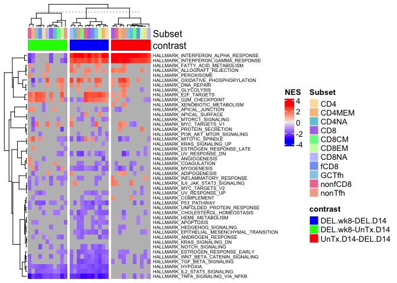

Joana2 peak analysis
================
Slim Fourati
2024-01-31

``` r
suppressPackageStartupMessages(library(package = "knitr"))
suppressPackageStartupMessages(library(package = "ComplexHeatmap"))
suppressPackageStartupMessages(library(package = "impute"))
suppressPackageStartupMessages(library(package = "limma"))
suppressPackageStartupMessages(library(package = "EDASeq"))
suppressPackageStartupMessages(library(package = "fgsea"))
suppressPackageStartupMessages(library(package = "kableExtra"))
suppressPackageStartupMessages(library(package = "tidyverse"))
```

``` r
opts_chunk$set(echo = TRUE, fig.path = "../figure/")
options(readr.show_col_types   = FALSE,
        dplyr.summarise.inform = FALSE)
workDir <- dirname(getwd())
```

### Differential expression between DEL.wk8, UnTx.D14 (DEL.D14 used as reference group)

``` r
load(file = file.path(workDir, "output/joana2.esetBaselined.RData"))
```

``` r
fits <- list()

# compare untreated wk2 Untr to wk8 DEL
for (SUBSET in unique(esetBaselined$Cell.population.sorted.1)) {
  esetTemp <- esetBaselined[, esetBaselined$Cell.population.sorted.1 %in% SUBSET &
                              ((esetBaselined$NHP.group %in% "UnTx" & 
                                esetBaselined$Timepoint %in% "D14") |
                               (esetBaselined$NHP.group %in% "DEL bNAb Tx"))]
  goi <- interaction(gsub(pattern     = " .+",
                          replacement = "",
                          esetTemp$NHP.group),
                     esetTemp$Timepoint,
                     drop = TRUE)
  designMat <- model.matrix(~0+goi) 
  rownames(designMat) <- sampleNames(esetTemp)
  colnames(designMat) <- gsub(pattern     = "goi",
                              replacement = "",
                              colnames(designMat))
  attr(designMat, "assign") <- attr(designMat, "contrasts") <- NULL
  dge <- ExpressionSet(assayData   = normCounts(esetTemp),
                       phenoData   = AnnotatedDataFrame(pData(esetTemp)),
                       featureData = AnnotatedDataFrame(fData(esetTemp)))
  fit <- lmFit(dge,
               design      = designMat)
  contrastMat <- makeContrasts(contrasts = c("DEL.wk8-UnTx.D14",
                                             "DEL.wk8-DEL.D14",
                                             "UnTx.D14-DEL.D14"), 
                               levels = fit$design)
  fit2 <- contrasts.fit(fit = fit, contrasts = contrastMat)
  fit2 <- eBayes(fit = fit2)
  fits[[paste0(SUBSET, "_peak")]] <- list(fit = fit, fit2 = fit2)
}

# compare WT wk2 to wk2 DEL
for (SUBSET in unique(esetBaselined$Cell.population.sorted.1)) {
  esetTemp <- esetBaselined[, esetBaselined$Cell.population.sorted.1 %in% SUBSET &
                              esetBaselined$Timepoint %in% "D14"]
  goi <- interaction(gsub(pattern     = " .+",
                          replacement = "",
                          esetTemp$NHP.group),
                     esetTemp$Timepoint,
                     drop = TRUE)
  designMat <- model.matrix(~0 + goi) 
  rownames(designMat) <- sampleNames(esetTemp)
  colnames(designMat) <- gsub(pattern     = "goi",
                              replacement = "",
                              colnames(designMat))
  attr(designMat, "assign") <- attr(designMat, "contrasts") <- NULL
  dge <- ExpressionSet(assayData     = normCounts(esetTemp),
                       phenoData     = AnnotatedDataFrame(pData(esetTemp)),
                       featureData   = AnnotatedDataFrame(fData(esetTemp)))
  fit <- lmFit(dge,
               design      = designMat)
  contrastMat <- makeContrasts(contrasts = c("DEL.D14-UnTx.D14",
                                             "DEL.D14-WT.D14",
                                             "WT.D14-UnTx.D14"), 
                               levels    = fit$design)
  fit2 <- contrasts.fit(fit = fit, contrasts = contrastMat)
  fit2 <- eBayes(fit = fit2)
  fits[[paste0(SUBSET, "_prepeak")]] <- list(fit = fit, fit2 = fit2)
}
```

``` r
topDEG <- NULL
for (modelName in grep(pattern = "peak", names(fits), value = TRUE)) {
  fit2 <- fits[[modelName]][["fit2"]]
  for (coefName in colnames(fit2)) {
    topTable(fits[[modelName]][["fit2"]],
             coef   = coefName,
             number = Inf) %>%
      group_by(sign(t)) %>%
      summarize(p = sum(P.Value <= 0.05),
                adjp = sum(adj.P.Val <= 0.05)) %>%
      ungroup() %>%
      mutate(modelName = modelName,
             contrast = coefName) %>%
      pivot_wider(names_from = `sign(t)`,
                  values_from = c(p, adjp)) %>%
      mutate(`p (UP/DN)` = paste0(`p_1`, "/", `p_-1`),
             `adjp (UP/DN)` = paste0(`adjp_1`, "/", `adjp_-1`)) %>%
      select(modelName, contrast, `p (UP/DN)`, `adjp (UP/DN)`) %>%
      rbind(topDEG, .) ->topDEG
   
  }
}
topDEG %>%
  filter(grepl(pattern = "_peak", modelName)) %>%
  kable(format = "pipe")
```

| modelName    | contrast         | p (UP/DN) | adjp (UP/DN) |
|:-------------|:-----------------|:----------|:-------------|
| CD4_peak     | DEL.wk8-UnTx.D14 | 373/525   | 0/0          |
| CD4_peak     | DEL.wk8-DEL.D14  | 220/310   | 0/0          |
| CD4_peak     | UnTx.D14-DEL.D14 | 361/246   | 0/0          |
| CD4MEM_peak  | DEL.wk8-UnTx.D14 | 432/349   | 0/0          |
| CD4MEM_peak  | DEL.wk8-DEL.D14  | 123/120   | 0/0          |
| CD4MEM_peak  | UnTx.D14-DEL.D14 | 412/441   | 0/0          |
| CD4NA_peak   | DEL.wk8-UnTx.D14 | 469/564   | 0/0          |
| CD4NA_peak   | DEL.wk8-DEL.D14  | 220/259   | 0/0          |
| CD4NA_peak   | UnTx.D14-DEL.D14 | 426/370   | 0/0          |
| CD8CM_peak   | DEL.wk8-UnTx.D14 | 622/632   | 0/0          |
| CD8CM_peak   | DEL.wk8-DEL.D14  | 229/348   | 0/0          |
| CD8CM_peak   | UnTx.D14-DEL.D14 | 346/326   | 0/0          |
| CD8EM_peak   | DEL.wk8-UnTx.D14 | 1085/1021 | 0/0          |
| CD8EM_peak   | DEL.wk8-DEL.D14  | 810/706   | 0/0          |
| CD8EM_peak   | UnTx.D14-DEL.D14 | 326/303   | 0/0          |
| CD8NA_peak   | DEL.wk8-UnTx.D14 | 394/480   | 0/0          |
| CD8NA_peak   | DEL.wk8-DEL.D14  | 385/407   | 0/0          |
| CD8NA_peak   | UnTx.D14-DEL.D14 | 413/237   | 0/0          |
| fCD8_peak    | DEL.wk8-UnTx.D14 | 679/744   | 0/0          |
| fCD8_peak    | DEL.wk8-DEL.D14  | 499/510   | 0/0          |
| fCD8_peak    | UnTx.D14-DEL.D14 | 396/282   | 0/0          |
| GCTfh_peak   | DEL.wk8-UnTx.D14 | 717/577   | 0/0          |
| GCTfh_peak   | DEL.wk8-DEL.D14  | 270/432   | 0/0          |
| GCTfh_peak   | UnTx.D14-DEL.D14 | 323/482   | 0/0          |
| nonTfh_peak  | DEL.wk8-UnTx.D14 | 304/327   | 0/0          |
| nonTfh_peak  | DEL.wk8-DEL.D14  | 381/558   | 0/0          |
| nonTfh_peak  | UnTx.D14-DEL.D14 | 569/582   | 0/0          |
| nonfCD8_peak | DEL.wk8-UnTx.D14 | 872/462   | 0/0          |
| nonfCD8_peak | DEL.wk8-DEL.D14  | 537/377   | 0/0          |
| nonfCD8_peak | UnTx.D14-DEL.D14 | 329/319   | 0/0          |
| CD8_peak     | DEL.wk8-UnTx.D14 | 513/588   | 0/0          |
| CD8_peak     | DEL.wk8-DEL.D14  | 412/394   | 0/0          |
| CD8_peak     | UnTx.D14-DEL.D14 | 572/360   | 0/0          |

No single genes was different between peak VL in UnTx and DEL. However,
no DEG was also identified with the reference group DEL.D14.

### Run geneset enrichment analysis

``` r
pathways <- gmtPathways(gmt.file = file.path("/Users/sfourat/Desktop/Projects/Utils/GSEA",
                                             "msigdb.v7.4.symbols.gmt"))

fgseaRes <- NULL
for (modelName in names(fits)) {
  fit2 <- fits[[modelName]][["fit2"]]
  for (coefName in setdiff(colnames(fit2), "(Intercept)")) {
    # print(coefName)
    top <- topTable(fit = fit2, coef = coefName, number = Inf)
    ranks <- setNames(top$t, top$gene_name)
    fgseaResTemp <- fgsea(pathways, ranks, minSize = 15, maxSize = 500) %>%
      mutate(modelName = modelName,
             contrast  = coefName)
    fgseaRes <- rbind(fgseaRes, fgseaResTemp)
  }
}
filter(fgseaRes, grepl(pattern = "INTERFERON$", pathway, ignore.case = TRUE) &
                `pval` <= 0.05 & grepl("^fCD8", modelName)) %>%
  select(modelName, contrast, pathway, NES, pval, padj) %>%
  kable() %>%
  kable_styling(font_size = 6)

save(fgseaRes, file = file.path(workDir, "data/joana2.fsgsea.RData"))
```

``` r
message("number of MSigDB (v7.4) significantly enriched between vax groups (FDR q-val <= 0.05):")
```

    ## number of MSigDB (v7.4) significantly enriched between vax groups (FDR q-val <= 0.05):

``` r
filter(fgseaRes, grepl(pattern = "_peak", modelName) & padj <= 0.05) %>%
  group_by(modelName, contrast, sign(NES)) %>%
  summarize(n = n()) %>%
  mutate(modelName= gsub(pattern = "_untx", replacement = "", modelName)) %>%
  pivot_wider(names_from = `sign(NES)`, values_from = n) %>%
  mutate("# UP/DN"  = paste0(`1`, "/", `-1`)) %>%
  select(modelName, contrast, `# UP/DN`) %>%
  kable(format = "pipe")
```

| modelName    | contrast         | \# UP/DN  |
|:-------------|:-----------------|:----------|
| CD4MEM_peak  | DEL.wk8-DEL.D14  | 917/1743  |
| CD4MEM_peak  | DEL.wk8-UnTx.D14 | 348/736   |
| CD4MEM_peak  | UnTx.D14-DEL.D14 | 940/852   |
| CD4NA_peak   | DEL.wk8-DEL.D14  | 427/356   |
| CD4NA_peak   | DEL.wk8-UnTx.D14 | 127/213   |
| CD4NA_peak   | UnTx.D14-DEL.D14 | 527/249   |
| CD4_peak     | DEL.wk8-DEL.D14  | 649/1534  |
| CD4_peak     | DEL.wk8-UnTx.D14 | 229/358   |
| CD4_peak     | UnTx.D14-DEL.D14 | 285/91    |
| CD8CM_peak   | DEL.wk8-DEL.D14  | 842/4033  |
| CD8CM_peak   | DEL.wk8-UnTx.D14 | 292/966   |
| CD8CM_peak   | UnTx.D14-DEL.D14 | 242/224   |
| CD8EM_peak   | DEL.wk8-DEL.D14  | 1118/6244 |
| CD8EM_peak   | DEL.wk8-UnTx.D14 | 1038/5285 |
| CD8EM_peak   | UnTx.D14-DEL.D14 | 879/586   |
| CD8NA_peak   | DEL.wk8-DEL.D14  | 1134/2790 |
| CD8NA_peak   | DEL.wk8-UnTx.D14 | 333/256   |
| CD8NA_peak   | UnTx.D14-DEL.D14 | 200/75    |
| CD8_peak     | DEL.wk8-DEL.D14  | 1220/1588 |
| CD8_peak     | DEL.wk8-UnTx.D14 | 94/334    |
| CD8_peak     | UnTx.D14-DEL.D14 | 782/110   |
| GCTfh_peak   | DEL.wk8-DEL.D14  | 1689/3164 |
| GCTfh_peak   | DEL.wk8-UnTx.D14 | 808/466   |
| GCTfh_peak   | UnTx.D14-DEL.D14 | 431/1560  |
| fCD8_peak    | DEL.wk8-DEL.D14  | 1160/2209 |
| fCD8_peak    | DEL.wk8-UnTx.D14 | 674/1124  |
| fCD8_peak    | UnTx.D14-DEL.D14 | 251/50    |
| nonTfh_peak  | DEL.wk8-DEL.D14  | 1046/5223 |
| nonTfh_peak  | DEL.wk8-UnTx.D14 | 10/568    |
| nonTfh_peak  | UnTx.D14-DEL.D14 | 1374/3060 |
| nonfCD8_peak | DEL.wk8-DEL.D14  | 1338/1134 |
| nonfCD8_peak | DEL.wk8-UnTx.D14 | 544/807   |
| nonfCD8_peak | UnTx.D14-DEL.D14 | 667/183   |

There is a large number of genesets enriched among DEGs between the
treatment groups. Let’s focus on hallmark genesets to determine if those
changes are similar across subset or subsets specific

### Hallmark NES heatmap

plotting only significant enrichment (nominal p\<=0.05)

``` r
nesMatSig <- filter(fgseaRes, 
                    grepl(pattern = "_peak", modelName) &
                    grepl(pattern = "^HALLMARK", pathway) &
                    pval <= 0.05) %>%
  mutate(cname = paste0(modelName, "/", contrast)) %>%
  select(NES, cname, pathway) %>%
  pivot_wider(names_from = cname, values_from = NES) %>%
  as.data.frame() %>%
  column_to_rownames(var = "pathway") %>%
  as.matrix()
distImpute <- function(x) {
  dist(x) %>%
    as.matrix() %>%
    impute.knn(colmax= 1) %>%
    .$data %>%
    as.dist()
}
colAnnot <- colnames(nesMatSig) %>%
  strsplit(split = "/") %>%
  do.call(what = rbind) %>%
  as.data.frame() %>%
  mutate(cname = paste0(V1, "/", V2)) %>%
  rename(Subset   = V1,
         contrast = V2) %>%
  mutate(Subset = gsub(pattern = "_peak", replacement = "", Subset)) %>%
  column_to_rownames(var = "cname")
colAnnot <- colAnnot[colnames(nesMatSig), ]
ha <- HeatmapAnnotation(df  = colAnnot,
                        col = list(contrast = c("DEL.wk8-DEL.D14"  = "blue",
                                                "DEL.wk8-UnTx.D14" = "green",
                                                "UnTx.D14-DEL.D14" = "red")))
Heatmap(matrix                      = nesMatSig,
        top_annotation              = ha,
        show_column_names           = FALSE,
        row_names_gp                = gpar(fontsize = 6),
        name                        = "NES",
        clustering_distance_rows    = distImpute,
        clustering_distance_columns = distImpute,
        column_split                = colAnnot$contrast,
        column_title                = NULL)
```


Most changes are consistent between subsets. The main difference between
DEL.wk8 and UnTx.D14 are linked to interferon signaling and NFkB
signaling (more prononced in UnTx) and E2F/Cell cyle (more elevated in
DEL.wk8).

Print Session info

``` r
sessionInfo()
```

    ## R version 4.3.2 (2023-10-31)
    ## Platform: aarch64-apple-darwin23.0.0 (64-bit)
    ## Running under: macOS Sonoma 14.3
    ## 
    ## Matrix products: default
    ## BLAS:   /opt/homebrew/Cellar/openblas/0.3.26/lib/libopenblasp-r0.3.26.dylib 
    ## LAPACK: /opt/homebrew/Cellar/r/4.3.2/lib/R/lib/libRlapack.dylib;  LAPACK version 3.11.0
    ## 
    ## locale:
    ## [1] en_US.UTF-8/en_US.UTF-8/en_US.UTF-8/C/en_US.UTF-8/en_US.UTF-8
    ## 
    ## time zone: America/Chicago
    ## tzcode source: internal
    ## 
    ## attached base packages:
    ## [1] stats4    grid      stats     graphics  grDevices utils     datasets 
    ## [8] methods   base     
    ## 
    ## other attached packages:
    ##  [1] lubridate_1.9.3             forcats_1.0.0              
    ##  [3] stringr_1.5.1               dplyr_1.1.4                
    ##  [5] purrr_1.0.2                 readr_2.1.5                
    ##  [7] tidyr_1.3.1                 tibble_3.2.1               
    ##  [9] ggplot2_3.4.4               tidyverse_2.0.0            
    ## [11] kableExtra_1.4.0            fgsea_1.28.0               
    ## [13] EDASeq_2.36.0               ShortRead_1.60.0           
    ## [15] GenomicAlignments_1.38.2    SummarizedExperiment_1.32.0
    ## [17] MatrixGenerics_1.14.0       matrixStats_1.2.0          
    ## [19] Rsamtools_2.18.0            GenomicRanges_1.54.1       
    ## [21] Biostrings_2.70.2           GenomeInfoDb_1.38.5        
    ## [23] XVector_0.42.0              IRanges_2.36.0             
    ## [25] S4Vectors_0.40.2            BiocParallel_1.36.0        
    ## [27] Biobase_2.62.0              BiocGenerics_0.48.1        
    ## [29] limma_3.58.1                impute_1.76.0              
    ## [31] ComplexHeatmap_2.18.0       knitr_1.45                 
    ## 
    ## loaded via a namespace (and not attached):
    ##   [1] RColorBrewer_1.1-3      rstudioapi_0.15.0       shape_1.4.6            
    ##   [4] magrittr_2.0.3          magick_2.8.2            GenomicFeatures_1.54.1 
    ##   [7] rmarkdown_2.25          GlobalOptions_0.1.2     BiocIO_1.12.0          
    ##  [10] zlibbioc_1.48.0         vctrs_0.6.5             memoise_2.0.1          
    ##  [13] RCurl_1.98-1.14         htmltools_0.5.7         S4Arrays_1.2.0         
    ##  [16] progress_1.2.3          curl_5.2.0              SparseArray_1.2.3      
    ##  [19] cachem_1.0.8            lifecycle_1.0.4         iterators_1.0.14       
    ##  [22] pkgconfig_2.0.3         Matrix_1.6-5            R6_2.5.1               
    ##  [25] fastmap_1.1.1           GenomeInfoDbData_1.2.11 clue_0.3-65            
    ##  [28] digest_0.6.34           colorspace_2.1-0        AnnotationDbi_1.64.1   
    ##  [31] RSQLite_2.3.5           hwriter_1.3.2.1         filelock_1.0.3         
    ##  [34] timechange_0.3.0        fansi_1.0.6             httr_1.4.7             
    ##  [37] abind_1.4-5             compiler_4.3.2          bit64_4.0.5            
    ##  [40] withr_3.0.0             doParallel_1.0.17       DBI_1.2.1              
    ##  [43] highr_0.10              R.utils_2.12.3          biomaRt_2.58.1         
    ##  [46] rappdirs_0.3.3          DelayedArray_0.28.0     rjson_0.2.21           
    ##  [49] tools_4.3.2             R.oo_1.26.0             glue_1.7.0             
    ##  [52] restfulr_0.0.15         cluster_2.1.6           generics_0.1.3         
    ##  [55] gtable_0.3.4            tzdb_0.4.0              R.methodsS3_1.8.2      
    ##  [58] data.table_1.15.0       hms_1.1.3               xml2_1.3.6             
    ##  [61] utf8_1.2.4              foreach_1.5.2           pillar_1.9.0           
    ##  [64] circlize_0.4.15         BiocFileCache_2.10.1    lattice_0.22-5         
    ##  [67] aroma.light_3.32.0      rtracklayer_1.62.0      bit_4.0.5              
    ##  [70] deldir_2.0-2            tidyselect_1.2.0        svglite_2.1.3          
    ##  [73] xfun_0.41               statmod_1.5.0           stringi_1.8.3          
    ##  [76] yaml_2.3.8              evaluate_0.23           codetools_0.2-19       
    ##  [79] interp_1.1-6            cli_3.6.2               systemfonts_1.0.5      
    ##  [82] munsell_0.5.0           Rcpp_1.0.12             dbplyr_2.4.0           
    ##  [85] png_0.1-8               XML_3.99-0.16.1         parallel_4.3.2         
    ##  [88] blob_1.2.4              prettyunits_1.2.0       latticeExtra_0.6-30    
    ##  [91] jpeg_0.1-10             bitops_1.0-7            viridisLite_0.4.2      
    ##  [94] scales_1.3.0            crayon_1.5.2            GetoptLong_1.0.5       
    ##  [97] rlang_1.1.3             cowplot_1.1.3           fastmatch_1.1-4        
    ## [100] KEGGREST_1.42.0
