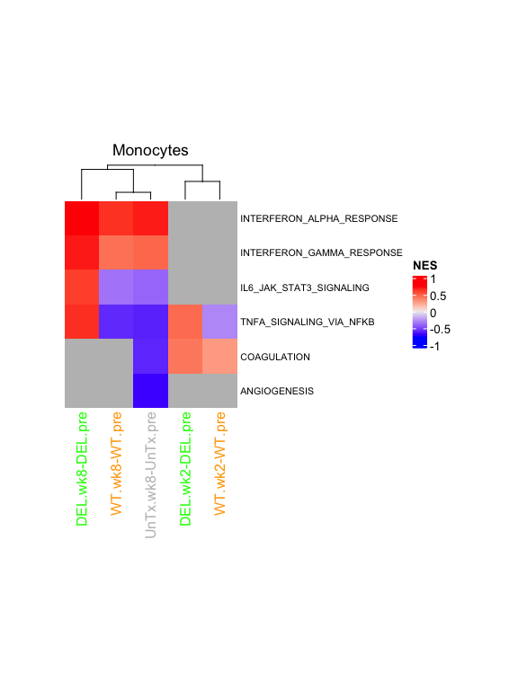
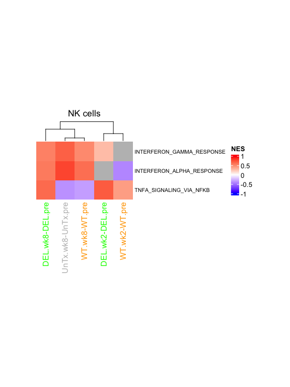

Dias/Koup Fig. 6A-B
================
Slim Fourati
2024-01-30

``` r
suppressPackageStartupMessages(library(package = "knitr"))
suppressPackageStartupMessages(library(package = "ComplexHeatmap"))
suppressPackageStartupMessages(library(package = "RColorBrewer"))
suppressPackageStartupMessages(library(package = "circlize"))
suppressPackageStartupMessages(library(package = "tidyverse"))
```

#### plot NES heatmaps for Hallmark genesets

``` r
load(file = file.path(workDir, "output/joana.gseaOutput.RData"))
```

# Figure 6A

``` r
MODELNAME <- "monocytes_vax"
  sigGS <- filter(gseaOutput, `modelName` %in% MODELNAME & 
                    !(contrast %in% "Untreated.D14-Untreated.pre") &
                    grepl(pattern = "HALLMARK_", NAME) &
                    `FDR q-val` <= 0.05) %>%
    .$NAME

  
  nesMat <- filter(gseaOutput, `modelName` %in% MODELNAME & 
                     !(contrast %in% "Untreated.D14-Untreated.pre") &
                    NAME %in% sigGS) %>%
    select(NES, contrast, NAME) %>%
    pivot_wider(names_from = contrast, values_from = NES) %>%
    column_to_rownames(var = "NAME") %>%
    as.matrix()
  nesNaMat <- filter(gseaOutput, `modelName` %in% MODELNAME & 
                     !(contrast %in% "Untreated.D14-Untreated.pre") &
                    NAME %in% sigGS & 
                      `NOM p-val` <= 0.05) %>%
  select(NES, contrast, NAME) %>%
    pivot_wider(names_from = contrast, values_from = NES) %>%
    column_to_rownames(var = "NAME") %>%
    as.matrix()
  nesNaMat <- nesNaMat[rownames(nesMat), colnames(nesMat)]
  heat <- Heatmap(matrix        = nesNaMat,
                  name          = "NES",
                  column_title  = "Monocytes",
                  width         = unit(2, units = "in"),
                  height        = unit(0.4 * nrow(nesNaMat), units = "in"),
                  row_names_gp  = gpar(fontsize = 8),
                  show_row_dend = FALSE,
                  clustering_distance_rows = dist(nesMat),
                  clustering_distance_columns = dist(t(nesMat)),
                  column_labels = gsub(pattern     = "Untreated",
                                       replacement = "UnTx",
                                       colnames(nesNaMat)) %>%
                                  gsub(pattern    = "D14",
                                       replacement = "wk2"),
                  row_labels = gsub(pattern = "HALLMARK_",
                                    replacement = "",
                                    rownames(nesNaMat)),
                  column_names_gp = gpar(col = c("green", "green", "grey", "orange", "orange")))
print(heat)
```



# Figure 6B

``` r
MODELNAME <- "NK cells_vax"
  sigGS <- filter(gseaOutput, `modelName` %in% MODELNAME & 
                    !(contrast %in% "Untreated.D14-Untreated.pre") &
                    grepl(pattern = "HALLMARK_", NAME) &
                    `FDR q-val` <= 0.05) %>%
    .$NAME

  
  nesMat <- filter(gseaOutput, `modelName` %in% MODELNAME & 
                     !(contrast %in% "Untreated.D14-Untreated.pre") &
                    NAME %in% sigGS) %>%
    select(NES, contrast, NAME) %>%
    pivot_wider(names_from = contrast, values_from = NES) %>%
    column_to_rownames(var = "NAME") %>%
    as.matrix()
  nesNaMat <- filter(gseaOutput, `modelName` %in% MODELNAME & 
                     !(contrast %in% "Untreated.D14-Untreated.pre") &
                    NAME %in% sigGS & 
                      `NOM p-val` <= 0.05) %>%
  select(NES, contrast, NAME) %>%
    pivot_wider(names_from = contrast, values_from = NES) %>%
    column_to_rownames(var = "NAME") %>%
    as.matrix()
  nesNaMat <- nesNaMat[rownames(nesMat), colnames(nesMat)]
  heat <- Heatmap(matrix        = nesNaMat,
                  col           = colorRamp2(breaks = c(-1, 0, 1),
                                           colors = c("blue", "white", "red")),
                  name          = "NES",
                  column_title  = "NK cells",
                  width         = unit(2, units = "in"),
                  height        = unit(0.4 * nrow(nesNaMat), units = "in"),
                  row_names_gp  = gpar(fontsize = 8),
                  show_row_dend = FALSE,
                  clustering_distance_rows = dist(nesMat),
                  clustering_distance_columns = dist(t(nesMat)),
                  column_labels = gsub(pattern     = "Untreated",
                                       replacement = "UnTx",
                                       colnames(nesNaMat)) %>%
                                  gsub(pattern    = "D14",
                                       replacement = "wk2"),
                  row_labels = gsub(pattern = "HALLMARK_",
                                    replacement = "",
                                    rownames(nesNaMat)),
                  column_names_gp = gpar(col = c("green", "green", "grey", "orange", "orange")))
print(heat)
```



``` r
sessionInfo()
```
